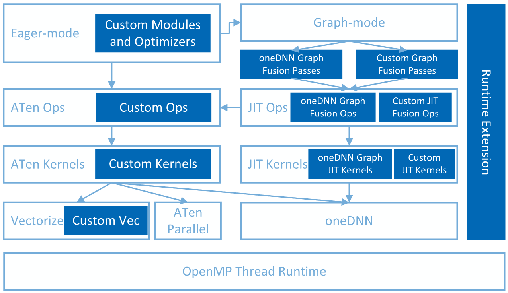

.. meta::
   :description: This website introduces Intel® Extension for PyTorch*
   :keywords: Intel optimization, PyTorch, Intel® Extension for PyTorch*, GPU, discrete GPU, Intel discrete GPU

Intel® Extension for PyTorch*
#############################

Intel® Extension for PyTorch* extends PyTorch* with the latest performance optimizations for Intel hardware. 
Optimizations take advantage of Intel® Advanced Vector Extensions 512 (Intel® AVX-512) Vector Neural Network Instructions (VNNI) and Intel® Advanced Matrix Extensions (Intel® AMX) on Intel CPUs as well as Intel X\ :sup:`e`\ Matrix Extensions (XMX) AI engines on Intel discrete GPUs. 
Moreover, Intel® Extension for PyTorch* provides easy GPU acceleration for Intel discrete GPUs through the PyTorch* ``xpu`` device.

In the current technological landscape, Generative AI (GenAI) workloads and models have gained widespread attention and popularity. Large Language Models (LLMs) have emerged as the dominant models driving these GenAI applications. Starting from 2.1.0, specific optimizations for certain 
LLMs are introduced in the Intel® Extension for PyTorch*. For more information on LLM optimizations, refer to the `Large Language Models (LLM) <tutorials/llm.html>`_ section.

The extension can be loaded as a Python module for Python programs or linked as a C++ library for C++ programs. In Python scripts, users can enable it dynamically by importing ``intel_extension_for_pytorch``.

.. note:: 
   
   - GPU features are not included in CPU-only packages.
   - Optimizations for CPU-only may have a newer code base due to different development schedules.

Intel® Extension for PyTorch* has been released as an open–source project at `Github <https://github.com/intel/intel-extension-for-pytorch>`_. You can find the source code and instructions on how to get started at:

- **CPU**: `CPU main branch <https://github.com/intel/intel-extension-for-pytorch/tree/main>`_ |  `Quick Start <https://intel.github.io/intel-extension-for-pytorch/cpu/latest/tutorials/getting_started>`_ 
- **XPU**: `XPU main branch <https://github.com/intel/intel-extension-for-pytorch/tree/xpu-main>`_ | `Quick Start <https://intel.github.io/intel-extension-for-pytorch/xpu/latest/tutorials/getting_started>`_

You can find more information about the product at:

- `Features <https://intel.github.io/intel-extension-for-pytorch/cpu/latest/tutorials/features>`_
- `Performance <https://intel.github.io/intel-extension-for-pytorch/cpu/latest/tutorials/performance>`_ 

Architecture
------------

Intel® Extension for PyTorch* is structured as shown in the following figure:

  Architecture of Intel® Extension for PyTorch*

- **Eager Mode**: In the eager mode, the PyTorch frontend is extended with custom Python modules (such as fusion modules), optimal optimizers, and INT8 quantization APIs. Further performance improvement is achieved by converting eager-mode models into graph mode using extended graph fusion passes. 
- **Graph Mode**: In the graph mode, fusions reduce operator/kernel invocation overhead, resulting in improved performance. Compared to the eager mode, the graph mode in PyTorch* normally yields better performance from the optimization techniques like operation fusion. Intel® Extension for PyTorch* amplifies them with more comprehensive graph optimizations. Both PyTorch ``Torchscript`` and ``TorchDynamo`` graph modes are supported. With ``Torchscript``, we recommend using ``torch.jit.trace()`` as your preferred option, as it generally supports a wider range of workloads compared to ``torch.jit.script()``. With ``TorchDynamo``, ipex backend is available to provide good performances.
- **CPU Optimization**: On CPU, Intel® Extension for PyTorch* automatically dispatches operators to underlying kernels based on detected instruction set architecture (ISA). The extension leverages vectorization and matrix acceleration units available on Intel hardware. The runtime extension offers finer-grained thread runtime control and weight sharing for increased efficiency.
- **GPU Optimization**: On GPU, optimized operators and kernels are implemented and registered through PyTorch dispatching mechanism. These operators and kernels are accelerated from native vectorization feature and matrix calculation feature of Intel GPU hardware. Intel® Extension for PyTorch* for GPU utilizes the `DPC++ <https://github.com/intel/llvm#oneapi-dpc-compiler>`_ compiler that supports the latest `SYCL* <https://registry.khronos.org/SYCL/specs/sycl-2020/html/sycl-2020.html>`_ standard and also a number of extensions to the SYCL* standard, which can be found in the `sycl/doc/extensions <https://github.com/intel/llvm/tree/sycl/sycl/doc/extensions>`_ directory. 

Support
-------
The team tracks bugs and enhancement requests using `GitHub issues <https://github.com/intel/intel-extension-for-pytorch/issues/>`_. Before submitting a suggestion or bug report, search the existing GitHub issues to see if your issue has already been reported.

.. toctree::
   :caption: ABOUT
   :maxdepth: 3
   :hidden:

   tutorials/introduction
   tutorials/features
   Large Language Models (LLM)<tutorials/llm>
   tutorials/performance
   tutorials/releases
   tutorials/known_issues
   tutorials/blogs_publications
   tutorials/license

.. toctree::
   :maxdepth: 3
   :caption: GET STARTED
   :hidden:

   tutorials/installation
   tutorials/getting_started
   tutorials/examples
   tutorials/cheat_sheet

.. toctree::
   :maxdepth: 3
   :caption: DEVELOPER REFERENCE
   :hidden:

   tutorials/api_doc
   
.. toctree::
   :maxdepth: 3
   :caption: PERFORMANCE TUNING
   :hidden:

   tutorials/performance_tuning/tuning_guide
   tutorials/performance_tuning/launch_script
   tutorials/performance_tuning/torchserve   
   
.. toctree::
   :maxdepth: 3
   :caption: CONTRIBUTING GUIDE
   :hidden:

   tutorials/contribution

