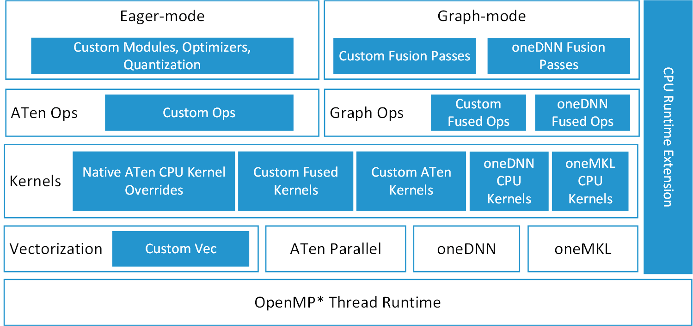
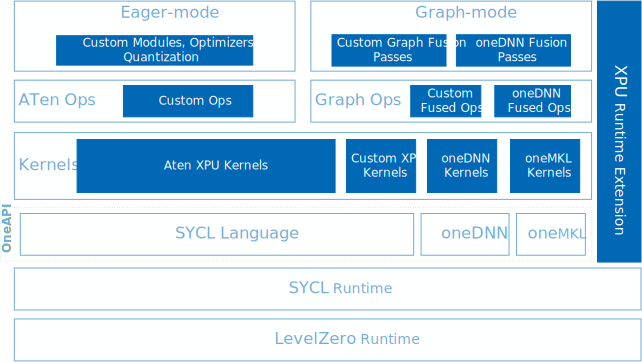

.. meta::
   :description: This website introduces Intel® Extension for PyTorch*
   :keywords: Intel optimization, PyTorch, Intel® Extension for PyTorch*, GPU, discrete GPU, Intel discrete GPU

Welcome to Intel® Extension for PyTorch* Documentation
######################################################

Intel® Extension for PyTorch* extends PyTorch* with up-to-date features optimizations for an extra performance boost on Intel hardware. Optimizations take advantage of AVX-512 Vector Neural Network Instructions (AVX512 VNNI) and Intel® Advanced Matrix Extensions (Intel® AMX) on Intel CPUs as well as Intel X\ :sup:`e`\  Matrix Extensions (XMX) AI engines on Intel discrete GPUs. Moreover, through PyTorch* `xpu` device, Intel® Extension for PyTorch* provides easy GPU acceleration for Intel discrete GPUs with PyTorch*.

Intel® Extension for PyTorch* provides optimizations for both eager mode and graph mode, however, compared to eager mode, graph mode in PyTorch* normally yields better performance from optimization techniques, such as operation fusion. Intel® Extension for PyTorch* amplifies them with more comprehensive graph optimizations. Therefore we recommend you to take advantage of Intel® Extension for PyTorch* with `TorchScript <https://pytorch.org/docs/stable/jit.html>`_ whenever your workload supports it. You could choose to run with `torch.jit.trace()` function or `torch.jit.script()` function, but based on our evaluation, `torch.jit.trace()` supports more workloads so we recommend you to use `torch.jit.trace()` as your first choice.

The extension can be loaded as a Python module for Python programs or linked as a C++ library for C++ programs. In Python scripts users can enable it dynamically by importing `intel_extension_for_pytorch`.

-------------------------------------

Intel® Extension for PyTorch* for CPU is structured as shown in the following figure:

PyTorch components are depicted with white boxes while Intel Extensions are with blue boxes. Extra performance of the extension is delivered via both custom addons and overriding existing PyTorch components. In eager mode, the PyTorch frontend is extended with custom Python modules (such as fusion modules), optimal optimizers and INT8 quantization API. Further performance boosting is available by converting the eager-mode model into graph mode via the extended graph fusion passes. Intel® Extension for PyTorch* dispatches the operators into their underlying kernels automatically based on ISA that it detects and leverages vectorization and matrix acceleration units available in Intel hardware, as much as possible. oneDNN library is used for computation intensive operations. Intel Extension for PyTorch runtime extension brings better efficiency with finer-grained thread runtime control and weight sharing.

Intel® Extension for PyTorch* for CPU has been released as an open–source project at `Github master branch <https://github.com/intel/intel-extension-for-pytorch/tree/master>`_. Check `CPU tutorial <https://intel.github.io/intel-extension-for-pytorch/cpu/latest/>`_ for detailed information of Intel® Extension for PyTorch* for Intel® CPUs.

-------------------------------------

Intel® Extension for PyTorch* for GPU is structured as shown in the following figure:

PyTorch components are depicted with white boxes and Intel extensions are with blue boxes. Extra performance of the extension comes from optimizations for both eager mode and graph mode. In eager mode, the PyTorch frontend is extended with custom Python modules (such as fusion modules), optimal optimizers, and INT8 quantization API. Further performance boosting is available by converting the eager-mode model into graph mode via extended graph fusion passes. On GPU, optimized operators and kernels are implemented and registered through PyTorch dispatching mechanism. These operators and kernels are accelerated from native vectorization feature and matrix calculation feature of Intel GPU hardware. In graph mode, further operator fusions are supported to reduce operator/kernel invocation overheads, and thus increase performance.

Intel® Extension for PyTorch* for GPU utilizes the `DPC++ <https://github.com/intel/llvm#oneapi-dpc-compiler>`_ compiler that supports the latest `SYCL* <https://registry.khronos.org/SYCL/specs/sycl-2020/html/sycl-2020.html>`_ standard and also a number of extensions to the SYCL* standard, which can be found in the `sycl/doc/extensions <https://github.com/intel/llvm/tree/sycl/sycl/doc/extensions>`_ directory. Intel® Extension for PyTorch* also integrates `oneDNN <https://github.com/oneapi-src/oneDNN>`_ and `oneMKL <https://github.com/oneapi-src/oneMKL>`_ libraries and provides kernels based on that. The oneDNN library is used for computation intensive operations. The oneMKL library is used for fundamental mathematical operations.

Intel® Extension for PyTorch* for GPU has been released as an open–source project on `GitHub xpu-master branch <https://github.com/intel/intel-extension-for-pytorch/tree/xpu-master>`_. Check `GPU tutorial <https://intel.github.io/intel-extension-for-pytorch/xpu/latest/>`_ for detailed information of Intel® Extension for PyTorch* for Intel® GPUs.

.. toctree::
   :hidden:
   :maxdepth: 1

   tutorials/features
   tutorials/releases
   tutorials/installation
   tutorials/examples
   tutorials/api_doc
   tutorials/contribution
   tutorials/license
