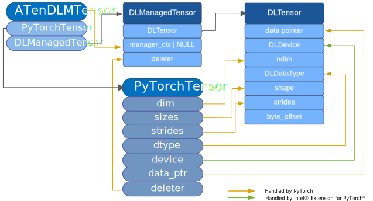

# DLPack Solution

## Introduction

[DLPack](https://dmlc.github.io/dlpack/latest/) defines a stable in-memory data structure for sharing tensors among frameworks. It is a solution with wide community adoption and supports Numpy, PyTorch, and other popular frameworks in deep learning domain. Intel® Extension for PyTorch\* extends DLPack support in PyTorch for XPU backend particularly, in order to share tensor data without copy when interoperating with other libraries via DLPack solution. The current supported DLPack version is [v0.7](https://github.com/dmlc/dlpack/releases/tag/v0.7).

## Use Case

The following use case demonstrates two typical DLPack usages relate to Intel® Extension for PyTorch\*. One is to import external tensor to Intel® Extension for PyTorch\*. The tensor from an external library is packed in DLPack capsule, then converted to PyTorch tensor on XPU, to be operable in Intel® Extension for PyTorch\*. The other is to export PyTorch tensor on XPU to an external library. The PyTorch tensor on XPU is packed in DLPack capsule, so that the external library can operate on this shared tensor via DLPack solution.

```python
import intel_extension_for_pytorch
import torch.utils.dlpack

# create DLPack capsule from external
capsule = …

# Usage 1: convert DLPack capsule to PyTorch tensor on XPU
t = torch.from_dlpack(capsule)

# create PyTorch tensor on XPU
t2 = torch.empty([10], device=’xpu’)

# Usage 2: convert PyTorch tensor on XPU to DLPack capsule
capsule2 = torch.to_dlpack(t2)

```

## Design

When import an external tensor which is in `DLManagedTensor` format, a PyTorch tensor is created and other required information such as `dim`, `sizes`, and `strides` are parsed and extracted from the external tensor to PyTorch tensor by Stock PyTorch. The `data_ptr` points to the original memory allocation and a data copy is not required. Here Intel® Extension for PyTorch\* is responsible for converting device type and id from `DLDevice` to ATen device for XPU backend. <br/>

### Import DLPack Capsule


When exporting PyTorch tensor, a `ATenDLMTensor` is created with its `handle` pointing to the original PyTorch tensor and its `tensor` contains the exported tensor in `DLManagedTensor` format. The required information such as `ndim`, `shape`, and `strides` are parsed and extracted from PyTorch tensor to external tensor. The `data pointer` points to the original memory allocation and data copy is not required. Here Intel® Extension for PyTorch\* is responsible for converting device type and id from ATen device to `DLDevice` for XPU backend. <br/>

### Export DLPack Capsule



Note: The used `DLManagedTensor` format in above figures is from https://dmlc.github.io/dlpack/latest/python_spec.html.

### `DLDevice` and `data pointer`

`DLDeviceType` in `DLDevice` is `kDLOneAPI` for sharing memory between Intel® Extension for PyTorch\* and other libraries. It is not `kDLSycl` since it relies on oneAPI SYCL extensions filter_selector and default platform context to operate. The `device_id` in `DLDevice` is one of the SYCL runtime root device ids, which may be different from the actual framework device in use. When producing a DLPack capsule, DPC++ runtime will get the device where memory allocation was original made, and if the device is a sub-device, DPC++ runtime will find parent root device and get its device index then put to `device_id`.

`data pointer` points to the shared data via DLPack to be accessed by consumer. Only USM allocations are valid in `data pointer` when `DLDeviceType` is `kDLOneAPI`. [SYCL 2020 Specification](https://registry.khronos.org/SYCL/specs/sycl-2020/html/sycl-2020.html) defines three types of USM allocations: `sycl::usm::host`, `sycl::usm::device`, and `sycl::usm::shared`. `sycl::usm::device` is the only supported type. Also the USM allocations in `sycl::usm::device` are valid in DLPack only when the memory allocation was made under [default SYCL context](https://github.com/intel/llvm/blob/sycl/sycl/doc/extensions/supported/sycl_ext_oneapi_default_context.asciidoc) per SYCL platform.

## Asynchronous Programming

So far, DLPack defines how the producer shares memory allocations in DLPack capsule format and how consumer recognizes the shared memory allocations. It does not define the synchronization method between producer and consumer so that both sides know when it is safe to access the data in shared memory allocations. Under the situation that the producer and the consumer probably have different implementation for supporting asynchronous programming, it is hard to define a general solution for various scenarios. It is up to consumer to monitor the execution flow of Intel® Extension for PyTorch\* and find out when the data is ready to use.

The following example shows one possible solution for the consumer to safely use USM allocations from Intel® Extension for PyTorch\*.

### Example Case

```python
import intel_extension_for_pytorch
import torch.utils.dlpack

# Get shared tensor from Intel® Extension for PyTorch* via DLPack
t = torch.from_dlpack(capsule)

# Wait for the data ready to use
torch.xpu.synchronize()

# Use the data in shared tensor
...
```
