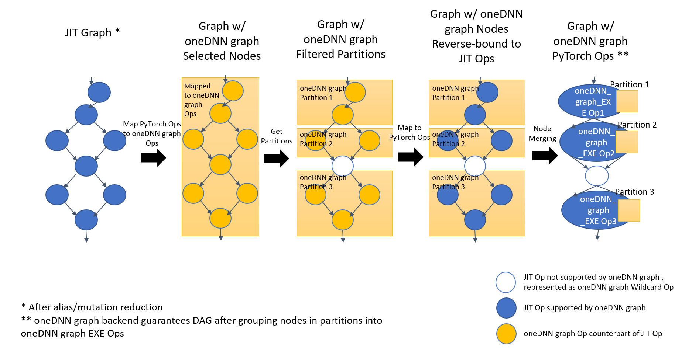

Intel® Extension for PyTorch\* optimizations for quantization (Experimental)
============================================================================

The quantization functionality in Intel® Extension for PyTorch\* currently only supports post-training static quantization. This tutorial introduces how the static quantization works in the Intel® Extension for PyTorch\* side.

Suppose there is a model as below:

```
import torch
import torch.nn as nn
import intel_extension_for_pytorch as ipex

class MyModel(nn.Module):
    def __init__(self):
        super(MyModel, self).__init__()
        self.conv = nn.Conv2d(10, 10, 3)
        
    def forward(self, x):
        x = self.conv(x)
        return x

model = MyModel().eval()

# user dataset for calibration.
xx_c = [torch.randn(1, 10, 28, 28) for i in range(2))
# user dataset for validation.
xx_v = [torch.randn(1, 10, 28, 28) for i in range(20))
```

## Calibration Step

Similar to the steps at PyTorch side, the first step is to perform calibration step to collect distributions of different activations. The distributions is then used to divide the entire range of activations into 256 levels.

At first, we need to define the quantization configuration determining which quantization scheme to be used for activation. Two values are supported: ``torch.per_tensor_affine`` and ``torch.per_tensor_symmetric``. The default qscheme is ``torch.per_tensor_affine``.

```
conf = ipex.quantization.QuantConf(qscheme=torch.per_tensor_affine)
```

then perform calibration using the calibration dataset:

```
with torch.no_grad():
    for x in xx_c:
        with ipex.quantization.calibrate(conf):
            y = model(x)

conf.save('configure.json')
```

In the last line, a ``.json`` file is saved. The file contains info of quantization, such as observer algorithm, activations, and weights scales:

```json
[
    {
        "id": 0,
        "name": "conv2d",
        "algorithm": "min_max",
        "weight_granularity": "per_channel",
        "input_scales": [
            0.02742583677172661
        ],
        "input_zero_points": [
            125
        ],
        "output_scales": [
            0.01582648977637291
        ],
        "output_zero_points": [
            120
        ],
        "weight_scales": [
            [
                0.0008243077900260687,
                0.0008239267044700682,
                0.0008076696540229023,
                0.000826483650598675,
                0.0008274353458546102,
                0.0008290993282571435,
                0.0007878943579271436,
                0.0008173943497240543,
                0.0008244941127486527,
                0.0008231988758780062
            ]
        ],
        "input_quantized_dtypes": [
            "uint8"
        ],
        "output_quantized_dtypes": [
            "uint8"
        ],
        "inputs_quantized": [
            true
        ],
        "outputs_quantized": [
            false
        ],
        "inputs_flow": [
            "conv2d0.input0"
        ],
        "outputs_flow": [
            "conv2d0.output0"
        ]
    }
]
```

Description of the json file can be found at [conf.py](https://github.com/intel/intel-extension-for-pytorch/blob/master/intel_extension_for_pytorch/quantization/conf.py).

## Model Conversion

After doing calibration steps, distributions of activations and weights are collected. The model can be converted to a quantized model with these info. Quantization in Intel® Extension for PyTorch\* takes advantage of [oneDNN graph API](https://spec.oneapi.io/onednn-graph/latest/introduction.html). This requires to be executed with TorchScript graph, thus, we need to convert the eager model to Torchscript model:

```
conf = ipex.quantization.QuantConf('configure.json')

with torch.no_grad():
    trace_model = ipex.quantization.convert(model, conf, example_input)
```

This step inserts some quantizer(``aten::quantize_per_tensor`` or ``aten::dequantize``) in the model. Meanwhile, [oneDNN graph API](https://spec.oneapi.io/onednn-graph/latest/introduction.html) will do graph optimization to replace some quantization pattens with quantization operators. More details can be found at [graph_optimization.md](./graph_optimization.md).

## Evaluate

After doing model conversion, we can do the evaluation step with your dataset by using the converted model:

```
with torch.no_grad():
    for x in xx_v:
        y = trace_model(x)
```

## Deploy the Converted Model

If you want to deploy your model on another device, you need to save the converted model:

```
 trace_model.save('quantization_model.pt')
```

and then load the saved model on your target device:

```
import intel_extension_for_pytorch as ipex
loaded = torch.jit.load('quantization_model.pt')
# running the model using your dataset
```

## Additional context

### Integration with oneDNN graph API
The quantization in Intel® Extension for PyTorch\* integrates [oneDNN graph API](https://spec.oneapi.io/onednn-graph/latest/introduction.html) with TorchScript graph of PyTorch.

The integration is mainly composed of the Graph Optimization part and the Graph Executor part:

#### Graph Optimization
We have registered quantization-related optimization passes in the Custom Pre-passes set of PyTorch:

1. Alias and mutation reduction

    Operators of oneDNN graph are pure functional, while PyTorch has operators in in-place forms or create views for buffer sharing.
    Due to the semantic gaps between the backend operators and the PyTorch operators, we have a pass to reduce mutation with best effort at the beginning.

2. Graph passing

    With a PyTorch TorchScript graph, the integration maps PyTorch operators in the graph to the corresponding backend operators to form a backend graph.

3. Partitioning

    The backend selects regions to be fused in the graph and return a list of partitions. Each partition corresponds to a fusion operator.

4. Graph rewriting

    The original PyTorch graph will be re-written based on the partitions returned from the backend. The operators in one partition will be grouped together to form a JIT operator.

The below diagram demonstrates the process of `Graph passing - Partitioning - Graph rewriting`:




5. Layout propagation

    This pass is to eliminate unnecessary layout conversions at boundaries. We set different formats to the output of a partition so that the backend could perform layout conversion internally. When `ANY` is set, the layout at boundaries will be fully decided by the backend. Otherwise, the backend should follow the layout set by the Framework.
    


#### Graph Executor
During runtime execution of a PyTorch TorchScript graph, oneDNN graph partition will be dispatched to the oneDNN graph JIT variadic Operator. 

Inside the oneDNN graph JIT Op, input PyTorch tensors of each partition will be mapped to oneDNN graph tensors. The partition will then be [compiled](https://spec.oneapi.io/onednn-graph/latest/programming_model.html#partition) and [executed](https://spec.oneapi.io/onednn-graph/latest/programming_model.html#compiled-partition). The output oneDNN graph tensor will be mapped back to PyTorch tensors to be fed to the next operator on the TorchScript graph.

### Limitations
#### Support for dynamic shapes
The support for dynamic shapes in Intel® Extension for PyTorch\* int8 integration is still working in progress.

For the use cases where the input shapes are dynamic, for example inputs of variable image sizes in an object detection task or of variable sequence lengths in NLP tasks, the Intel® Extension for PyTorch\* int8 path may slow down the model inference.
