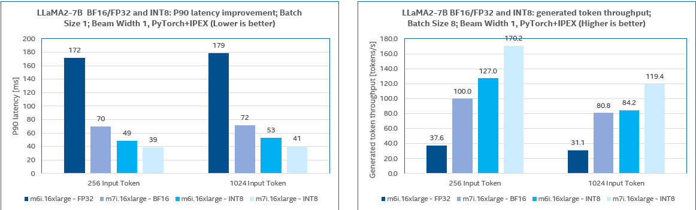
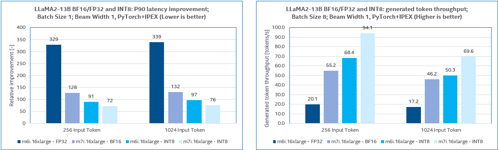
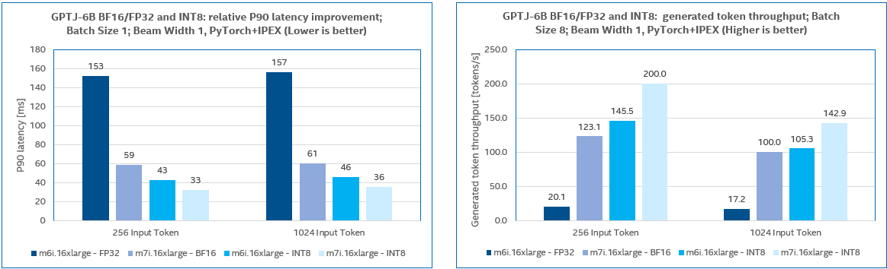

Performance
===========

## Overview

This page shows performance boost with Intel® Extension for PyTorch\* on several popular topologies.

## Performance Data for Intel® AI Data Center Products

Find the latest performance data for 4th gen Intel® Xeon® Scalable processors and 3rd gen Intel® Xeon® processors, including detailed hardware and software configurations, at [Intel® Developer Zone article](https://www.intel.com/content/www/us/en/developer/topic-technology/artificial-intelligence/performance.html).

## LLM Performance

We benchmarked LLaMA2 7B, 13B, GPT-J 6B with test input token length set to 256 and 1024 respectively. The tests were carried out on AWS M7i and M6i instances. CPUs of M6i instances are 3rd Gen Intel® Xeon® Processors which do not have AMX instructions for BF16 computing acceleration, so we take FP32 precision for benchmarking instead of BF16 on M6i instances.

The LLM inference performances on M7i and M6i instances are compared based on the above results. M7i, with the 4th Gen Xeon® processors, has a remarkable performance advantage over M6i with the 3rd Gen Xeon® processors.

M7i performance boost ratio over M6i for non-quantized (BF16 or FP32) models:

|            | Speedup | Throughput |
|:----------:|:-------:|:----------:|
|  LLaMA2 7B |  2.47x  |    2.62x   |
| LLaMA2 13B |  2.57x  |    2.62x   |
|  GPT-J 6B  |  2.58x  |    2.85x   |

M7i performance boost ratio over M6i for INT8 quantized models:

|            | Speedup | Throughput |
|:----------:|:-------:|:----------:|
|  LLaMA2 7B |  1.27x  |    1.38x   |
| LLaMA2 13B |  1.27x  |    1.27x   |
|  GPT-J 6B  |  1.29x  |    1.36x   |

We can also conclude that **with a larger batch size the capacity of the model service can be improved at the cost of longer response latency for the individual sessions**. The following table exhibits that for INT8 quantized LLaMA2-7b model on M7i instances, input batch_size=8 would increase the total throughput by 6.47x compared with batch_size=1, whereas P90 token latency gets 1.26x longer.

| Batch size | Decoder latency | Total tokens per sec |
|:----------:|:---------------:|:--------------------:|
|      1     |        39       |         26.32        |
|      8     |        49       |        170.21        |
|            |                 |                      |
|***Ratio*** |      1.26x      |         6.47x        |

*Note:* Measured by Intel on 17th Aug 2023; M7i.16xLarge, M6i.16xLarge instances in US-west-2. OS-Ubuntu 22.04-lts, kernel 6.20.0-1009-aws, SW: PyTorch* 2.1 and Intel® Extension for PyTorch* 2.1/llm_feature_branch.

## INT8 with v1.11

### Performance Numbers

<table border="1" cellpadding="10" align="center" class="perf_table">
<tbody>
  <col>
  <col>
  <col>
  <colgroup span="2"></colgroup>
  <colgroup span="2"></colgroup>
  <col>
  <col>
  <col>
  <tr>
    <th rowspan="2" scope="col">Hardware</th>
    <th rowspan="2" scope="col">Workload1</th>
    <th rowspan="2" scope="col">Precision</th>
    <th colspan="2" scope="colgroup">Throughput Inference2</th>
    <th colspan="2" scope="colgroup">Realtime Inference3</th>
    <th rowspan="2" scope="col">Model Type</th>
    <th rowspan="2" scope="col">Dataset</th>
    <th rowspan="2" scope="col">Input Data Shape</th>
    <th rowspan="2" scope="col">Tunable Parameters</th>
  </tr>
  <tr>
    <th scope="col">Batch Size</th>
    <th scope="col">Boost Ratio</th>
    <th scope="col">Batch Size</th>
    <th scope="col">Boost Ratio</th>
  </tr>
  <tr>
    <td style="text-align: center; vertical-align: middle" rowspan="10" scope="col">Intel(R) Xeon(R) Platinum 8380 CPU @ 2.30GHz</td>
    <td style="text-align: center; vertical-align: middle" scope="col">ResNet50</td>
    <td style="text-align: center; vertical-align: middle" scope="col">INT8</td>
    <td style="text-align: center; vertical-align: middle" scope="col">80</td>
    <td style="text-align: center; vertical-align: middle" scope="col">1.83x</td>
    <td style="text-align: center; vertical-align: middle" scope="col">1</td>
    <td style="text-align: center; vertical-align: middle" scope="col">1.44x</td>
    <td style="text-align: center; vertical-align: middle" scope="col">Computer Vision</td>
    <td style="text-align: center; vertical-align: middle" scope="col">ImageNet</td>
    <td style="text-align: center; vertical-align: middle" scope="col">Input shape [3, 224, 224]</td>
    <td style="text-align: center; vertical-align: middle" scope="col">Default memory allocator; Intel(R) OpenMP; <a href="https://github.com/IntelAI/models/tree/pytorch-r1.11-models/quickstart/image_recognition/pytorch/resnet50/inference/cpu">inference scripts</a></td>
  </tr>
  <tr>
    <td style="text-align: center; vertical-align: middle" scope="col">SSD-ResNet34</td>
    <td style="text-align: center; vertical-align: middle" scope="col">INT8</td>
    <td style="text-align: center; vertical-align: middle" scope="col">80</td>
    <td style="text-align: center; vertical-align: middle" scope="col">2.16x</td>
    <td style="text-align: center; vertical-align: middle" scope="col">1</td>
    <td style="text-align: center; vertical-align: middle" scope="col">1.83x</td>
    <td style="text-align: center; vertical-align: middle" scope="col">Computer Vision</td>
    <td style="text-align: center; vertical-align: middle" scope="col">COCO</td>
    <td style="text-align: center; vertical-align: middle" scope="col">Input shape [3, 1200, 1200]</td>
    <td style="text-align: center; vertical-align: middle" scope="col">Default memory allocator; Intel(R) OpenMP; <a href="https://github.com/IntelAI/models/tree/pytorch-r1.11-models/quickstart/object_detection/pytorch/ssd-resnet34/inference/cpu">inference scripts</a></td>
  </tr>
  <tr>
    <td style="text-align: center; vertical-align: middle" scope="col">ResNext 32x16d</td>
    <td style="text-align: center; vertical-align: middle" scope="col">INT8</td>
    <td style="text-align: center; vertical-align: middle" scope="col">80</td>
    <td style="text-align: center; vertical-align: middle" scope="col">1.81x</td>
    <td style="text-align: center; vertical-align: middle" scope="col">1</td>
    <td style="text-align: center; vertical-align: middle" scope="col">1.21x</td>
    <td style="text-align: center; vertical-align: middle" scope="col">Computer Vision</td>
    <td style="text-align: center; vertical-align: middle" scope="col">ImageNet</td>
    <td style="text-align: center; vertical-align: middle" scope="col">Input shape [3, 224, 224]</td>
    <td style="text-align: center; vertical-align: middle" scope="col">Default memory allocator; Intel(R) OpenMP; <a href="https://github.com/IntelAI/models/tree/pytorch-r1.11-models/quickstart/image_recognition/pytorch/resnext-32x16d/inference/cpu">inference scripts</a></td>
  </tr>
  <tr>
    <td style="text-align: center; vertical-align: middle" scope="col">VGG-11</td>
    <td style="text-align: center; vertical-align: middle" scope="col">INT8</td>
    <td style="text-align: center; vertical-align: middle" scope="col">80</td>
    <td style="text-align: center; vertical-align: middle" scope="col">1.75x</td>
    <td style="text-align: center; vertical-align: middle" scope="col">1</td>
    <td style="text-align: center; vertical-align: middle" scope="col">1.19x</td>
    <td style="text-align: center; vertical-align: middle" scope="col">Computer Vision</td>
    <td style="text-align: center; vertical-align: middle" scope="col">ImageNet</td>
    <td style="text-align: center; vertical-align: middle" scope="col">Input shape [3, 224, 224]</td>
    <td style="text-align: center; vertical-align: middle" scope="col">Default memory allocator; Intel(R) OpenMP; <a href="https://github.com/IntelAI/models/tree/pytorch-r1.11-models/quickstart/image_recognition/pytorch/vgg11/inference/cpu">inference scripts</a></td>
  </tr>
  <tr>
    <td style="text-align: center; vertical-align: middle" scope="col">ShuffleNetv2_x1.0</td>
    <td style="text-align: center; vertical-align: middle" scope="col">INT8</td>
    <td style="text-align: center; vertical-align: middle" scope="col">80</td>
    <td style="text-align: center; vertical-align: middle" scope="col">2.07x</td>
    <td style="text-align: center; vertical-align: middle" scope="col">1</td>
    <td style="text-align: center; vertical-align: middle" scope="col">1.47x</td>
    <td style="text-align: center; vertical-align: middle" scope="col">Computer Vision</td>
    <td style="text-align: center; vertical-align: middle" scope="col">ImageNet</td>
    <td style="text-align: center; vertical-align: middle" scope="col">Input shape [3, 224, 224]</td>
    <td style="text-align: center; vertical-align: middle" scope="col">Default memory allocator; Intel(R) OpenMP;</td>
  </tr>
  <tr>
    <td style="text-align: center; vertical-align: middle" scope="col">BERT-Large</td>
    <td style="text-align: center; vertical-align: middle" scope="col">INT8</td>
    <td style="text-align: center; vertical-align: middle" scope="col">80</td>
    <td style="text-align: center; vertical-align: middle" scope="col">2.78x</td>
    <td style="text-align: center; vertical-align: middle" scope="col">1</td>
    <td style="text-align: center; vertical-align: middle" scope="col">2.04x</td>
    <td style="text-align: center; vertical-align: middle" scope="col">NLP</td>
    <td style="text-align: center; vertical-align: middle" scope="col">Squad</td>
    <td style="text-align: center; vertical-align: middle" scope="col">max_seq_len=384 Task: Question Answering</td>
    <td style="text-align: center; vertical-align: middle" scope="col">Jemalloc; Intel(R) OpenMP; <a href="https://github.com/IntelAI/models/tree/pytorch-r1.11-models/quickstart/language_modeling/pytorch/bert_large/inference/cpu">inference scripts</a></td>
  </tr>
  <tr>
    <td style="text-align: center; vertical-align: middle" scope="col">Bert-Base</td>
    <td style="text-align: center; vertical-align: middle" scope="col">INT8</td>
    <td style="text-align: center; vertical-align: middle" scope="col">80</td>
    <td style="text-align: center; vertical-align: middle" scope="col">2.05x</td>
    <td style="text-align: center; vertical-align: middle" scope="col">1</td>
    <td style="text-align: center; vertical-align: middle" scope="col">1.96x</td>
    <td style="text-align: center; vertical-align: middle" scope="col">NLP</td>
    <td style="text-align: center; vertical-align: middle" scope="col">MRPC</td>
    <td style="text-align: center; vertical-align: middle" scope="col">max_seq_len=128 Task: Text Classification</td>
    <td style="text-align: center; vertical-align: middle" scope="col">Jemalloc; Intel(R) OpenMP; <a href="https://github.com/IntelAI/models/tree/pytorch-r1.11-models/quickstart/language_modeling/pytorch/bert_base/inference/cpu">inference scripts</a></td>
  </tr>
  <tr>
    <td style="text-align: center; vertical-align: middle" scope="col">DistilBERT-Base</td>
    <td style="text-align: center; vertical-align: middle" scope="col">INT8</td>
    <td style="text-align: center; vertical-align: middle" scope="col">80</td>
    <td style="text-align: center; vertical-align: middle" scope="col">2.12x</td>
    <td style="text-align: center; vertical-align: middle" scope="col">1</td>
    <td style="text-align: center; vertical-align: middle" scope="col">1.57x</td>
    <td style="text-align: center; vertical-align: middle" scope="col">NLP</td>
    <td style="text-align: center; vertical-align: middle" scope="col">Squad</td>
    <td style="text-align: center; vertical-align: middle" scope="col">max_seq_len=384 Task: Question Answering</td>
    <td style="text-align: center; vertical-align: middle" scope="col">Jemalloc; Intel(R) OpenMP; <a href="https://github.com/IntelAI/models/tree/pytorch-r1.11-models/quickstart/language_modeling/pytorch/distilbert_base/inference/cpu">inference scripts</a></td>
  </tr>
</tbody>
</table>

 
1. <a href="https://github.com/IntelAI/models/tree/pytorch-r1.11-models">Model Zoo for Intel® Architecture</a>
 
2. Throughput inference runs with single instance per socket.
 
3. Realtime inference runs with multiple instances, 4 cores per instance.
 

*Note:* Performance numbers with stock PyTorch are measured with its most performant configuration.

*Note:* Environment variable *DNNL_PRIMITIVE_CACHE_CAPACITY* is set to *1024*.

### Accuracy

<table border="1" cellpadding="10" align="center" class="perf_table">
<tbody>
  <tr>
    <th>Workload</th>
    <th>Metric</th>
    <th>FP32</th>
    <th>INT8</th>
    <th>INT8/FP32</th>
  </tr>
  <tr>
    <td style="text-align: center; vertical-align: middle">BERT-base_text_classification</td>
    <td style="text-align: center; vertical-align: middle">f1</td>
    <td style="text-align: center; vertical-align: middle">0.81</td>
    <td style="text-align: center; vertical-align: middle">0.81</td>
    <td style="text-align: center; vertical-align: middle">99.79%</td>
  </tr>
  <tr>
    <td style="text-align: center; vertical-align: middle">BERT-Large</td>
    <td style="text-align: center; vertical-align: middle">f1</td>
    <td style="text-align: center; vertical-align: middle">93.16</td>
    <td style="text-align: center; vertical-align: middle">93.02</td>
    <td style="text-align: center; vertical-align: middle">99.85%</td>
  </tr>
  <tr>
    <td style="text-align: center; vertical-align: middle">Distilbert-base</td>
    <td style="text-align: center; vertical-align: middle">f1</td>
    <td style="text-align: center; vertical-align: middle">86.84</td>
    <td style="text-align: center; vertical-align: middle">86.13</td>
    <td style="text-align: center; vertical-align: middle">99.19%</td>
  </tr>
  <tr>
    <td style="text-align: center; vertical-align: middle">ResNet50</td>
    <td style="text-align: center; vertical-align: middle">Top1</td>
    <td style="text-align: center; vertical-align: middle">76.15</td>
    <td style="text-align: center; vertical-align: middle">75.98</td>
    <td style="text-align: center; vertical-align: middle">99.78%</td>
  </tr>
  <tr>
    <td style="text-align: center; vertical-align: middle">ResNext 32x16d</td>
    <td style="text-align: center; vertical-align: middle">Top1</td>
    <td style="text-align: center; vertical-align: middle">84.17</td>
    <td style="text-align: center; vertical-align: middle">84.05</td>
    <td style="text-align: center; vertical-align: middle">99.86%</td>
  </tr>
  <tr>
    <td style="text-align: center; vertical-align: middle">SSD-ResNet34</td>
    <td style="text-align: center; vertical-align: middle">mAP</td>
    <td style="text-align: center; vertical-align: middle">0.200</td>
    <td style="text-align: center; vertical-align: middle">0.199</td>
    <td style="text-align: center; vertical-align: middle">99.48%</td>
  </tr>
  <tr>
    <td style="text-align: center; vertical-align: middle">VGG11</td>
    <td style="text-align: center; vertical-align: middle">Top1</td>
    <td style="text-align: center; vertical-align: middle">69.04</td>
    <td style="text-align: center; vertical-align: middle">67.96</td>
    <td style="text-align: center; vertical-align: middle">98.44%</td>
  </tr>
  <tr>
    <td style="text-align: center; vertical-align: middle">Shufflenetv2_x1.0</td>
    <td style="text-align: center; vertical-align: middle">Top1</td>
    <td style="text-align: center; vertical-align: middle">69.36</td>
    <td style="text-align: center; vertical-align: middle">67.92</td>
    <td style="text-align: center; vertical-align: middle">97.93%1</td>
  </tr>
</tbody>
</table>

 
1. ShuffleNet INT8 accuracy is expected to improve w/o performance trade-off via histogram calibration algorithm.
 

### Configuration

#### Software Version

| Software | Version |
| :-: | :-: |
| PyTorch | [v1.11.0](https://pytorch.org/get-started/locally/) |
| Intel® Extension for PyTorch\* | [v1.11.0](https://github.com/intel/intel-extension-for-pytorch/releases) |

#### Hardware Configuration

| | 3rd Generation Intel® Xeon® Scalable Processors |
| :-: | :-: |
| CPU | Intel(R) Xeon(R) Platinum 8380 CPU @ 2.30GHz |
| Number of nodes | 1 |
| Number of sockets | 2 |
| Cores/Socket | 40 |
| Threads/Core | 2 |
| uCode | 0xd0002a0 |
| Hyper-Threading | ON |
| TurboBoost | ON |
| BIOS version | 04.12.02 |
| Number of DDR Memory slots | 16 |
| Capacity of DDR memory per slot | 16GB |
| DDR frequency | 3200 |
| Total Memory/Node (DDR+DCPMM) | 256GB |
| Host OS | CentOS Linux release 8.4.2105 |
| Host Kernel | 4.18.0-305.10.2.el8\_4.x86\_64 |
| Docker OS | Ubuntu 18.04.5 LTS |
| [Spectre-Meltdown Mitigation](https://github.com/speed47/spectre-meltdown-checker) | Mitigated |

## FP32 with v1.11.200 on an AWS EC2 C6i.2xlarge instance

### Performance Numbers

<table border="1" cellpadding="10" align="center" class="perf_table">
<tbody>
  <col>
  <col>
  <col>
  <colgroup span="2"></colgroup>
  <colgroup span="2"></colgroup>
  <col>
  <col>
  <col>
  <tr>
    <th rowspan="2" scope="col">Hardware</th>
    <th rowspan="2" scope="col">Workload1</th>
    <th rowspan="2" scope="col">Precision</th>
    <th colspan="2" scope="colgroup">Throughput Inference2</th>
    <th colspan="2" scope="colgroup">Real-time Inference3</th>
    <th rowspan="2" scope="col">Model Type</th>
    <th rowspan="2" scope="col">Dataset</th>
    <th rowspan="2" scope="col">Input Data Shape</th>
    <th rowspan="2" scope="col">Tunable Parameters</th>
  </tr>
  <tr>
    <th scope="col">Batch Size</th>
    <th scope="col">Boost Ratio</th>
    <th scope="col">Batch Size</th>
    <th scope="col">Boost Ratio</th>
  </tr>
  <tr>
    <td style="text-align: center; vertical-align: middle" rowspan="10" scope="col">AWS EC2 C6i.2xlarge</td>
    <td style="text-align: center; vertical-align: middle" scope="col">ResNet50</td>
    <td style="text-align: center; vertical-align: middle" scope="col">Float32</td>
    <td style="text-align: center; vertical-align: middle" scope="col">64</td>
    <td style="text-align: center; vertical-align: middle" scope="col">1.24x</td>
    <td style="text-align: center; vertical-align: middle" scope="col">1</td>
    <td style="text-align: center; vertical-align: middle" scope="col">1.31x</td>
    <td style="text-align: center; vertical-align: middle" scope="col">Computer Vision</td>
    <td style="text-align: center; vertical-align: middle" scope="col">ImageNet</td>
    <td style="text-align: center; vertical-align: middle" scope="col">Input shape [3, 224, 224]</td>
    <td style="text-align: center; vertical-align: middle" scope="col">Default memory allocator; Intel(R) OpenMP; <a href="https://github.com/IntelAI/models/tree/pytorch-r1.10-models/quickstart/image_recognition/pytorch/resnet50/inference/cpu">inference scripts</a></td>
  </tr>
  <tr>
    <td style="text-align: center; vertical-align: middle" scope="col">ResNext 32x16d</td>
    <td style="text-align: center; vertical-align: middle" scope="col">Float32</td>
    <td style="text-align: center; vertical-align: middle" scope="col">64</td>
    <td style="text-align: center; vertical-align: middle" scope="col">1.07x</td>
    <td style="text-align: center; vertical-align: middle" scope="col">1</td>
    <td style="text-align: center; vertical-align: middle" scope="col">1.05x</td>
    <td style="text-align: center; vertical-align: middle" scope="col">Computer Vision</td>
    <td style="text-align: center; vertical-align: middle" scope="col">ImageNet</td>
    <td style="text-align: center; vertical-align: middle" scope="col">Input shape [3, 224, 224]</td>
    <td style="text-align: center; vertical-align: middle" scope="col">Default memory allocator; Intel(R) OpenMP; <a href="https://github.com/IntelAI/models/tree/pytorch-r1.10-models/quickstart/image_recognition/pytorch/resnext-32x16d/inference/cpu">inference scripts</a></td>
  </tr>
  <tr>
    <td style="text-align: center; vertical-align: middle" scope="col">VGG-11</td>
    <td style="text-align: center; vertical-align: middle" scope="col">Float32</td>
    <td style="text-align: center; vertical-align: middle" scope="col">64</td>
    <td style="text-align: center; vertical-align: middle" scope="col">1.15x</td>
    <td style="text-align: center; vertical-align: middle" scope="col">1</td>
    <td style="text-align: center; vertical-align: middle" scope="col">1.21x</td>
    <td style="text-align: center; vertical-align: middle" scope="col">Computer Vision</td>
    <td style="text-align: center; vertical-align: middle" scope="col">ImageNet</td>
    <td style="text-align: center; vertical-align: middle" scope="col">Input shape [3, 224, 224]</td>
    <td style="text-align: center; vertical-align: middle" scope="col">Default memory allocator; Intel(R) OpenMP; <a href="https://github.com/IntelAI/models/tree/pytorch-r1.10-models/quickstart/image_recognition/pytorch/vgg11/inference/cpu">inference scripts</a></td>
  </tr>
  <tr>
    <td style="text-align: center; vertical-align: middle" scope="col">ShuffleNetv2_x1.0</td>
    <td style="text-align: center; vertical-align: middle" scope="col">Float32</td>
    <td style="text-align: center; vertical-align: middle" scope="col">64</td>
    <td style="text-align: center; vertical-align: middle" scope="col">1.12x</td>
    <td style="text-align: center; vertical-align: middle" scope="col">1</td>
    <td style="text-align: center; vertical-align: middle" scope="col">1.30x</td>
    <td style="text-align: center; vertical-align: middle" scope="col">Computer Vision</td>
    <td style="text-align: center; vertical-align: middle" scope="col">ImageNet</td>
    <td style="text-align: center; vertical-align: middle" scope="col">Input shape [3, 224, 224]</td>
    <td style="text-align: center; vertical-align: middle" scope="col">Default memory allocator; Intel(R) OpenMP;</td>
  </tr>
  <tr>
    <td style="text-align: center; vertical-align: middle" scope="col">MobileNet v2</td>
    <td style="text-align: center; vertical-align: middle" scope="col">Float32</td>
    <td style="text-align: center; vertical-align: middle" scope="col">64</td>
    <td style="text-align: center; vertical-align: middle" scope="col">1.08x</td>
    <td style="text-align: center; vertical-align: middle" scope="col">1</td>
    <td style="text-align: center; vertical-align: middle" scope="col">1.12x</td>
    <td style="text-align: center; vertical-align: middle" scope="col">Computer Vision</td>
    <td style="text-align: center; vertical-align: middle" scope="col">ImageNet</td>
    <td style="text-align: center; vertical-align: middle" scope="col">Input shape [3, 224, 224]</td>
    <td style="text-align: center; vertical-align: middle" scope="col">Default memory allocator; Intel(R) OpenMP;</td>
  </tr>
  <tr>
    <td style="text-align: center; vertical-align: middle" scope="col">BERT-Large</td>
    <td style="text-align: center; vertical-align: middle" scope="col">Float32</td>
    <td style="text-align: center; vertical-align: middle" scope="col">64</td>
    <td style="text-align: center; vertical-align: middle" scope="col">1.05x</td>
    <td style="text-align: center; vertical-align: middle" scope="col">1</td>
    <td style="text-align: center; vertical-align: middle" scope="col">1.03x</td>
    <td style="text-align: center; vertical-align: middle" scope="col">NLP</td>
    <td style="text-align: center; vertical-align: middle" scope="col">Squad</td>
    <td style="text-align: center; vertical-align: middle" scope="col">max_seq_len=384 Task: Question Answering</td>
    <td style="text-align: center; vertical-align: middle" scope="col">Default memory allocator; Intel(R) OpenMP; <a href="https://github.com/IntelAI/models/tree/pytorch-r1.10-models/quickstart/language_modeling/pytorch/bert_large/inference/cpu">inference scripts</a>; Recommend to set auto_kernel_selection to ON when seq_len exceeds 64</td>
  </tr>
  <tr>
    <td style="text-align: center; vertical-align: middle" scope="col">Bert-Base</td>
    <td style="text-align: center; vertical-align: middle" scope="col">Float32</td>
    <td style="text-align: center; vertical-align: middle" scope="col">64</td>
    <td style="text-align: center; vertical-align: middle" scope="col">1.08x</td>
    <td style="text-align: center; vertical-align: middle" scope="col">1</td>
    <td style="text-align: center; vertical-align: middle" scope="col">1.09x</td>
    <td style="text-align: center; vertical-align: middle" scope="col">NLP</td>
    <td style="text-align: center; vertical-align: middle" scope="col">MRPC</td>
    <td style="text-align: center; vertical-align: middle" scope="col">max_seq_len=128 Task: Text Classification</td>
    <td style="text-align: center; vertical-align: middle" scope="col">Jemalloc; Intel(R) OpenMP; <a href="https://github.com/IntelAI/models/tree/pytorch-r1.10-models/quickstart/language_modeling/pytorch/bert_base/inference/cpu">inference scripts</a>; Recommend to set auto_kernel_selection to ON when seq_len exceeds 128</td>
  </tr>
</tbody>
</table>

 
1. <a href="https://github.com/IntelAI/models/tree/pytorch-r1.11-models">Model Zoo for Intel® Architecture</a>
 
2. Throughput inference runs with single instance per socket.
 
3. Realtime inference runs with multiple instances, 4 cores per instance.
 

*Note:* Performance numbers with stock PyTorch are measured with its most performant configuration.

*Note:* Environment variable *DNNL_PRIMITIVE_CACHE_CAPACITY* is set to *1024*.

### Configuration

#### Software Version

| Software | Version |
| :-: | :-: |
| PyTorch | [v1.11.0](https://pytorch.org/get-started/locally/) |
| Intel® Extension for PyTorch\* | [v1.11.200](https://github.com/intel/intel-extension-for-pytorch/releases) |

## FP32 and BFloat16 with v1.10

### Performance Numbers

<table border="1" cellpadding="10" align="center" class="perf_table">
<tbody>
  <col>
  <col>
  <col>
  <colgroup span="2"></colgroup>
  <colgroup span="2"></colgroup>
  <col>
  <col>
  <col>
  <tr>
    <th rowspan="2" scope="col">Hardware</th>
    <th rowspan="2" scope="col">Workload1</th>
    <th rowspan="2" scope="col">Precision</th>
    <th colspan="2" scope="colgroup">Throughput Inference2</th>
    <th colspan="2" scope="colgroup">Real-time Inference3</th>
    <th rowspan="2" scope="col">Model Type</th>
    <th rowspan="2" scope="col">Dataset</th>
    <th rowspan="2" scope="col">Input Data Shape</th>
    <th rowspan="2" scope="col">Tunable Parameters</th>
  </tr>
  <tr>
    <th scope="col">Batch Size</th>
    <th scope="col">Boost Ratio</th>
    <th scope="col">Batch Size</th>
    <th scope="col">Boost Ratio</th>
  </tr>
  <tr>
    <td style="text-align: center; vertical-align: middle" rowspan="10" scope="col">Intel(R) Xeon(R) Platinum 8380 CPU @ 2.30GHz</td>
    <td style="text-align: center; vertical-align: middle" scope="col">ResNet50</td>
    <td style="text-align: center; vertical-align: middle" scope="col">Float32</td>
    <td style="text-align: center; vertical-align: middle" scope="col">80</td>
    <td style="text-align: center; vertical-align: middle" scope="col">1.39x</td>
    <td style="text-align: center; vertical-align: middle" scope="col">1</td>
    <td style="text-align: center; vertical-align: middle" scope="col">1.35x</td>
    <td style="text-align: center; vertical-align: middle" scope="col">Computer Vision</td>
    <td style="text-align: center; vertical-align: middle" scope="col">ImageNet</td>
    <td style="text-align: center; vertical-align: middle" scope="col">Input shape [3, 224, 224]</td>
    <td style="text-align: center; vertical-align: middle" scope="col">Default memory allocator; Intel(R) OpenMP; <a href="https://github.com/IntelAI/models/tree/pytorch-r1.10-models/quickstart/image_recognition/pytorch/resnet50/inference/cpu">inference scripts</a></td>
  </tr>
  <tr>
    <td style="text-align: center; vertical-align: middle" scope="col">SSD-ResNet34</td>
    <td style="text-align: center; vertical-align: middle" scope="col">Float32</td>
    <td style="text-align: center; vertical-align: middle" scope="col">160</td>
    <td style="text-align: center; vertical-align: middle" scope="col">1.55x</td>
    <td style="text-align: center; vertical-align: middle" scope="col">1</td>
    <td style="text-align: center; vertical-align: middle" scope="col">1.06x</td>
    <td style="text-align: center; vertical-align: middle" scope="col">Computer Vision</td>
    <td style="text-align: center; vertical-align: middle" scope="col">COCO</td>
    <td style="text-align: center; vertical-align: middle" scope="col">Input shape [3, 1200, 1200]</td>
    <td style="text-align: center; vertical-align: middle" scope="col">Default memory allocator; Intel(R) OpenMP; <a href="https://github.com/IntelAI/models/tree/pytorch-r1.10-models/quickstart/object_detection/pytorch/ssd-resnet34/inference/cpu">inference scripts</a></td>
  </tr>
  <tr>
    <td style="text-align: center; vertical-align: middle" scope="col">ResNext 32x16d</td>
    <td style="text-align: center; vertical-align: middle" scope="col">Float32</td>
    <td style="text-align: center; vertical-align: middle" scope="col">80</td>
    <td style="text-align: center; vertical-align: middle" scope="col">1.08x</td>
    <td style="text-align: center; vertical-align: middle" scope="col">1</td>
    <td style="text-align: center; vertical-align: middle" scope="col">1.08x</td>
    <td style="text-align: center; vertical-align: middle" scope="col">Computer Vision</td>
    <td style="text-align: center; vertical-align: middle" scope="col">ImageNet</td>
    <td style="text-align: center; vertical-align: middle" scope="col">Input shape [3, 224, 224]</td>
    <td style="text-align: center; vertical-align: middle" scope="col">Default memory allocator; Intel(R) OpenMP; <a href="https://github.com/IntelAI/models/tree/pytorch-r1.10-models/quickstart/image_recognition/pytorch/resnext-32x16d/inference/cpu">inference scripts</a></td>
  </tr>
  <tr>
    <td style="text-align: center; vertical-align: middle" scope="col">Faster R-CNN ResNet50 FPN</td>
    <td style="text-align: center; vertical-align: middle" scope="col">Float32</td>
    <td style="text-align: center; vertical-align: middle" scope="col">80</td>
    <td style="text-align: center; vertical-align: middle" scope="col">1.71x</td>
    <td style="text-align: center; vertical-align: middle" scope="col">1</td>
    <td style="text-align: center; vertical-align: middle" scope="col">1.07x</td>
    <td style="text-align: center; vertical-align: middle" scope="col">Computer Vision</td>
    <td style="text-align: center; vertical-align: middle" scope="col">COCO</td>
    <td style="text-align: center; vertical-align: middle" scope="col">Input shape [3, 1200, 1200]</td>
    <td style="text-align: center; vertical-align: middle" scope="col">Default memory allocator; Intel(R) OpenMP; <a href="https://github.com/IntelAI/models/tree/pytorch-r1.10-models/quickstart/object_detection/pytorch/maskrcnn_resnet50_fpn/inference/cpu">inference scripts</a></td>
  </tr>
  <tr>
    <td style="text-align: center; vertical-align: middle" scope="col">VGG-11</td>
    <td style="text-align: center; vertical-align: middle" scope="col">Float32</td>
    <td style="text-align: center; vertical-align: middle" scope="col">160</td>
    <td style="text-align: center; vertical-align: middle" scope="col">1.20x</td>
    <td style="text-align: center; vertical-align: middle" scope="col">1</td>
    <td style="text-align: center; vertical-align: middle" scope="col">1.13x</td>
    <td style="text-align: center; vertical-align: middle" scope="col">Computer Vision</td>
    <td style="text-align: center; vertical-align: middle" scope="col">ImageNet</td>
    <td style="text-align: center; vertical-align: middle" scope="col">Input shape [3, 224, 224]</td>
    <td style="text-align: center; vertical-align: middle" scope="col">Default memory allocator; Intel(R) OpenMP; <a href="https://github.com/IntelAI/models/tree/pytorch-r1.10-models/quickstart/image_recognition/pytorch/vgg11/inference/cpu">inference scripts</a></td>
  </tr>
  <tr>
    <td style="text-align: center; vertical-align: middle" scope="col">ShuffleNetv2_x1.0</td>
    <td style="text-align: center; vertical-align: middle" scope="col">Float32</td>
    <td style="text-align: center; vertical-align: middle" scope="col">160</td>
    <td style="text-align: center; vertical-align: middle" scope="col">1.32x</td>
    <td style="text-align: center; vertical-align: middle" scope="col">1</td>
    <td style="text-align: center; vertical-align: middle" scope="col">1.20x</td>
    <td style="text-align: center; vertical-align: middle" scope="col">Computer Vision</td>
    <td style="text-align: center; vertical-align: middle" scope="col">ImageNet</td>
    <td style="text-align: center; vertical-align: middle" scope="col">Input shape [3, 224, 224]</td>
    <td style="text-align: center; vertical-align: middle" scope="col">Default memory allocator; Intel(R) OpenMP;</td>
  </tr>
  <tr>
    <td style="text-align: center; vertical-align: middle" scope="col">MobileNet v2</td>
    <td style="text-align: center; vertical-align: middle" scope="col">Float32</td>
    <td style="text-align: center; vertical-align: middle" scope="col">160</td>
    <td style="text-align: center; vertical-align: middle" scope="col">1.48x</td>
    <td style="text-align: center; vertical-align: middle" scope="col">1</td>
    <td style="text-align: center; vertical-align: middle" scope="col">1.12x</td>
    <td style="text-align: center; vertical-align: middle" scope="col">Computer Vision</td>
    <td style="text-align: center; vertical-align: middle" scope="col">ImageNet</td>
    <td style="text-align: center; vertical-align: middle" scope="col">Input shape [3, 224, 224]</td>
    <td style="text-align: center; vertical-align: middle" scope="col">Default memory allocator; Intel(R) OpenMP;</td>
  </tr>
  <tr>
    <td style="text-align: center; vertical-align: middle" scope="col">DLRM</td>
    <td style="text-align: center; vertical-align: middle" scope="col">Float32</td>
    <td style="text-align: center; vertical-align: middle" scope="col">80</td>
    <td style="text-align: center; vertical-align: middle" scope="col">1.11x</td>
    <td style="text-align: center; vertical-align: middle" scope="col">1</td>
    <td style="text-align: center; vertical-align: middle" scope="col">-</td>
    <td style="text-align: center; vertical-align: middle" scope="col">Recommendation</td>
    <td style="text-align: center; vertical-align: middle" scope="col">Terabyte</td>
    <td style="text-align: center; vertical-align: middle" scope="col">-</td>
    <td style="text-align: center; vertical-align: middle" scope="col">Default memory allocator; Intel(R) OpenMP; <a href="https://github.com/IntelAI/models/tree/pytorch-r1.10-models/quickstart/recommendation/pytorch/dlrm/inference/cpu">inference scripts</a></td>
  </tr>
  <tr>
    <td style="text-align: center; vertical-align: middle" scope="col">BERT-Large</td>
    <td style="text-align: center; vertical-align: middle" scope="col">Float32</td>
    <td style="text-align: center; vertical-align: middle" scope="col">80</td>
    <td style="text-align: center; vertical-align: middle" scope="col">1.14x</td>
    <td style="text-align: center; vertical-align: middle" scope="col">1</td>
    <td style="text-align: center; vertical-align: middle" scope="col">1.02x</td>
    <td style="text-align: center; vertical-align: middle" scope="col">NLP</td>
    <td style="text-align: center; vertical-align: middle" scope="col">Squad</td>
    <td style="text-align: center; vertical-align: middle" scope="col">max_seq_len=384 Task: Question Answering</td>
    <td style="text-align: center; vertical-align: middle" scope="col">Default memory allocator; Intel(R) OpenMP; <a href="https://github.com/IntelAI/models/tree/pytorch-r1.10-models/quickstart/language_modeling/pytorch/bert_large/inference/cpu">inference scripts</a>; Recommend to set auto_kernel_selection to ON when seq_len exceeds 64</td>
  </tr>
  <tr>
    <td style="text-align: center; vertical-align: middle" scope="col">Bert-Base</td>
    <td style="text-align: center; vertical-align: middle" scope="col">Float32</td>
    <td style="text-align: center; vertical-align: middle" scope="col">160</td>
    <td style="text-align: center; vertical-align: middle" scope="col">1.10x</td>
    <td style="text-align: center; vertical-align: middle" scope="col">1</td>
    <td style="text-align: center; vertical-align: middle" scope="col">1.33x</td>
    <td style="text-align: center; vertical-align: middle" scope="col">NLP</td>
    <td style="text-align: center; vertical-align: middle" scope="col">MRPC</td>
    <td style="text-align: center; vertical-align: middle" scope="col">max_seq_len=128 Task: Text Classification</td>
    <td style="text-align: center; vertical-align: middle" scope="col">Jemalloc; Intel(R) OpenMP; <a href="https://github.com/IntelAI/models/tree/pytorch-r1.10-models/quickstart/language_modeling/pytorch/bert_base/inference/cpu">inference scripts</a>; Recommend to set auto_kernel_selection to ON when seq_len exceeds 128</td>
  </tr>
  <tr>
    <td style="text-align: center; vertical-align: middle" rowspan="2" scope="col">Intel(R) Xeon(R) Platinum 8380H CPU @ 2.90GHz</td>
    <td style="text-align: center; vertical-align: middle" scope="col">BERT-Large</td>
    <td style="text-align: center; vertical-align: middle" scope="col">BFloat16</td>
    <td style="text-align: center; vertical-align: middle" scope="col">56</td>
    <td style="text-align: center; vertical-align: middle" scope="col">1.67x</td>
    <td style="text-align: center; vertical-align: middle" scope="col">1</td>
    <td style="text-align: center; vertical-align: middle" scope="col">1.45x</td>
    <td style="text-align: center; vertical-align: middle" scope="col">NLP</td>
    <td style="text-align: center; vertical-align: middle" scope="col">Squad</td>
    <td style="text-align: center; vertical-align: middle" scope="col">max_seq_len=384 Task: Question Answering</td>
    <td style="text-align: center; vertical-align: middle" scope="col">Jemalloc; Intel(R) OpenMP; <a href="https://github.com/IntelAI/models/tree/pytorch-r1.10-models/quickstart/language_modeling/pytorch/bert_large/inference/cpu">inference scripts</a></td>
  </tr>
  <tr>
    <td style="text-align: center; vertical-align: middle" scope="col">Bert-Base</td>
    <td style="text-align: center; vertical-align: middle" scope="col">BFloat16</td>
    <td style="text-align: center; vertical-align: middle" scope="col">112</td>
    <td style="text-align: center; vertical-align: middle" scope="col">1.77x</td>
    <td style="text-align: center; vertical-align: middle" scope="col">1</td>
    <td style="text-align: center; vertical-align: middle" scope="col">1.18x</td>
    <td style="text-align: center; vertical-align: middle" scope="col">NLP</td>
    <td style="text-align: center; vertical-align: middle" scope="col">MRPC</td>
    <td style="text-align: center; vertical-align: middle" scope="col">max_seq_len=128 Task: Text Classification</td>
    <td style="text-align: center; vertical-align: middle" scope="col">Jemalloc; Intel(R) OpenMP; <a href="https://github.com/IntelAI/models/tree/pytorch-r1.10-models/quickstart/language_modeling/pytorch/bert_base/inference/cpu">inference scripts</a></td>
  </tr>
</tbody>
</table>

 
1. <a href="https://github.com/IntelAI/models/tree/pytorch-r1.10-models">Model Zoo for Intel® Architecture</a>
 
2. Throughput inference runs with single instance per socket.
 
3. Realtime inference runs with multiple instances, 4 cores per instance.
 

*Note:* Performance numbers with stock PyTorch are measured with its most performant configuration.

*Note:* Environment variable *DNNL_PRIMITIVE_CACHE_CAPACITY* is set to *1024*.

### Configuration

#### Software Version

| Software | Version |
| :-: | :-: |
| PyTorch | [v1.10.1](https://pytorch.org/get-started/locally/) |
| Intel® Extension for PyTorch\* | [v1.10.100](https://github.com/intel/intel-extension-for-pytorch/releases) |

#### Hardware Configuration

| | 3rd Generation Intel® Xeon® Scalable Processors | Products formerly Cooper Lake |
| :-: | :-: | :-: |
| CPU | Intel(R) Xeon(R) Platinum 8380 CPU @ 2.30GHz | Intel(R) Xeon(R) Platinum 8380H CPU @ 2.90GHz
|
| Number of nodes | 1 | 1 |
| Number of sockets | 2 | 2 |
| Cores/Socket | 40 | 28 |
| Threads/Core | 2 | 2 |
| uCode | 0xd0002a0 | 0x700001c |
| Hyper-Threading | ON | ON |
| TurboBoost | ON | ON |
| BIOS version | 04.12.02 | WLYDCRB1.SYS.0016.P29.2006080250 |
| Number of DDR Memory slots | 16 | 12 |
| Capacity of DDR memory per slot | 16GB | 64GB |
| DDR frequency | 3200 | 3200 |
| Total Memory/Node (DDR+DCPMM) | 256GB | 768GB |
| Host OS | CentOS Linux release 8.4.2105 | Ubuntu 18.04.4 LTS |
| Host Kernel | 4.18.0-305.10.2.el8\_4.x86\_64 | 4.15.0-76-generic |
| Docker OS | Ubuntu 18.04.5 LTS | Ubuntu 18.04.5 LTS |
| [Spectre-Meltdown Mitigation](https://github.com/speed47/spectre-meltdown-checker) | Mitigated | Mitigated |
