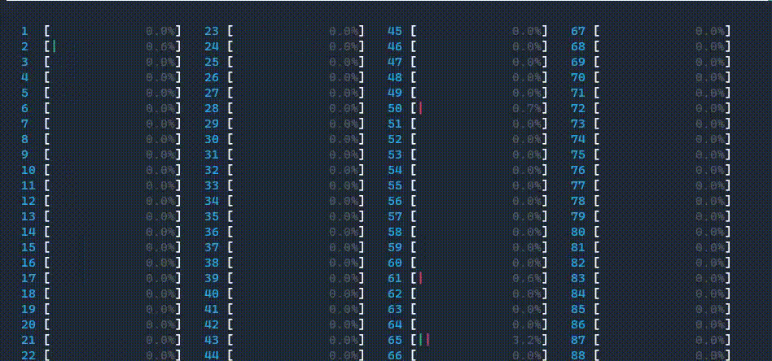

Launch Script Usage Guide
=========================

## Overview

As introduced in [Performance Tuning Guide](tuning_guide.md), there are several factors that influence performance very much. Setting those configurations properly contributes to performance boost. However, there is no unified configuration that is optimal to all topologies. Users need to try different combinations by themselves. A *launch* script is provided to automate these configuration settings to free users from this complicated work. This guide helps you to learn some most frequent usage examples. They covers optimized configurations in most cases.

The configurations are mainly around the following perspectives. Italic values are default if applicable.
1. OpenMP library: [*Intel OpenMP library* | GNU OpenMP library]
2. Memory allocator: [PyTorch default memory allocator | Jemalloc | *TCMalloc*]
3. Number of instances: [*Single instance* | Multiple instances]

## Usage of launch script

The *launch* script is provided as a module of *intel_extension_for_pytorch*. You can take advantage of it with the following command:
```
python -m intel_extension_for_pytorch.cpu.launch [knobs] <your_pytorch_script> [args]
```

Available knobs are listed below:

| knob | type | default value | help |
| :-- | :--: | :--: | :-- |
| ```-m```, ```--module``` | - | False | Changes each process to interpret the launch script  as a python module, executing with the same behavior as 'python -m'. |
| ```--no_python``` | - | False | Do not prepend the --program script with \python\ - just exec  it directly. Useful when the script is not a Python script. |
| ```--ninstances``` | int | -1 | For multi-instance, you should give the cores number you used for per instance. |
| ```--instance_idx``` | int | -1 | Specify instance_idx to run single instance among multiple instances. Useful when running each instance independently. |
| ```--ncore_per_instance``` | int | -1 | Cores per instance |
| ```--skip_cross_node_cores``` | - | False | When specifying --ncore_per_instance, set --skip_cross_node_cores to skip any cross-node cores. |
| ```--latency_mode``` | - | False | By default 4 core per instance and use all physical cores |
| ```--throughput_mode``` | - | False | By default one instance per numa node and use all physical cores |
| ```--node_id``` | int | -1 | Node id for multi-instance, by default all numa nodes will be used |
| ```--use_logical_core``` | - | False | Whether only use physical cores |
| ```--disable_numactl``` | - | False | Disable numactl |
| ```--disable_taskset``` | - | False | Disable taskset |
| ```--core_list``` | str | None | Specify the core list as 'core_id, core_id, ....', otherwise, all the cores will be used. |
| ```--log_path``` | str | '' | The log file path. Default path is '', which means disable logging to files. |
| ```--log_file_prefix``` | str | 'run' | log file prefix |
| ```--disable_iomp``` | - | False | By default, we use Intel OpenMP and libiomp5.so will be add to LD_PRELOAD |
| ```--enable_tcmalloc``` | - | False | Enable tcmalloc allocator |
| ```--enable_jemalloc``` | - | False | Enable jemalloc allocator |
| ```--use_default_allocator``` | - |  False | Use default memory allocator |

**Note:** ```--latency_mode``` and ```--throughput_mode``` are exclusive knobs to ```--ninstances```, ```--ncore_per_instance```, ```--node_id``` and ```--use_logical_core```. I.e., setting either of ```--latency_mode``` or ```--throughput_mode``` overwrites settings of ```--ninstances```, ```--ncore_per_instance```, ```--node_id``` and ```--use_logical_core``` if they are explicitly set in command line. ```--latency_mode``` and ```--throughput_mode``` are mutually exclusive.

```--skip_cross_node_cores``` is exclusive knob to ```--ninstances```. I.e., setting ```--skip_cross_node_cores``` overwrites setting of ```--ninstances``` if it is explicitly set in command line. 

The *launch* script respects existing environment variables when it get launched, expect for *LD_PRELOAD*. If you have your favorite values for certain environment variables, you can set them before running the *launch* script. A typical usage scenario is as the following. Intel OpenMP library uses an environment variable *KMP_AFFINITY* to control its behavior. Different settings result in different performance numbers. By default, if you enable Intel OpenMP library, the *launch* script will set *KMP_AFFINITY* to "granularity=fine,compact,1,0". If you want to try with other values, you can use *export* command on Linux to set *KMP_AFFINITY* before you run the *launch* script. In this case, the script will not set the default value but take the existing value of *KMP_AFFINITY*, and print a message to stdout.

Execution via the *launch* script can dump logs into files under a designated log directory so that it will be convenient to do some investigations afterward. By default, it is disabled to avoid undesired log files. You can enable logging by setting knob ```--log_path``` to be 1 directory to save log files. It can be absolute path or relative path. 2 types of files will be generated. One file (```<prefix>_timestamp_instances.log```) contains command and information when the script was launched. Another type of files (```<prefix>_timestamp_instance_N_core#-core#....log```) contain stdout print of each instance.

E.g.
```
run_20210712212258_instances.log
run_20210712212258_instance_0_cores_0-43.log
```

## Usage Examples

Example script [resnet50.py](../examples/resnet50.py) will be used in this guide.

- Single instance for inference
  - [I. Use all physical cores](#i-use-all-physical-cores)
  - [II. Use all cores including logical cores](#ii-use-all-cores-including-logical-cores)
  - [III. Use physical cores on 1 node](#iii-use-physical-cores-on-1-node)
  - [IV. Use your designated number of cores](#iv-use-your-designated-number-of-cores)
- Multiple instances for inference
  - [V. Throughput mode (i.e. number of numa node instances, each instance runs on 1 numa node)](#v-throughput-mode)
  - [VI. Latency mode (Use 4 cores for each instance)](#vi-latency-mode)
  - [VII. Your designated number of instances](#vii-your-designated-number-of-instances)
  - [VIII. Your designated number of instances and instance index](#viii-your-designated-number-of-instances-and-instance-index)
- Usage of Jemalloc/TCMalloc/Default memory allocator
  - [Jemalloc](#jemalloc)
  - [TCMalloc](#tcmalloc)
  - [Default memory allocator](#default-memory-allocator)
- Usage of GNU OpenMP library
  - [Intel OpenMP library](#intel-openmp-library)
  - [GNU OpenMP library](#gnu-openmp-library)

__Note:__ GIF files below intend to show CPU usage ONLY. Please do NOT induct performance numbers.

### Single instance for inference

#### I. Use all physical cores

```
python -m intel_extension_for_pytorch.cpu.launch --log_path ./logs resnet50.py
```

CPU usage is shown as below. 1 main worker thread was launched, then it launched physical core number of threads on all physical cores.


If you check your log directory, you will find directory structure as below.

```
.
├── resnet50.py
└── logs
    ├── run_20210712212258_instance_0_cores_0-43.log
    └── run_20210712212258_instances.log
```

The ```run_20210712212258_instances.log``` contains information and command that were used for this execution launch.
```
$ cat logs/run_20210712212258_instances.log
2021-07-12 21:22:58,764 - __main__ - WARNING - Both TCMalloc and JeMalloc are not found in $CONDA_PREFIX/lib or $VIRTUAL_ENV/lib or /.local/lib/ or /usr/local/lib/ or /usr/local/lib64/ or /usr/lib or /usr/lib64 or /home/<user>/.local/lib/ so the LD_PRELOAD environment variable will not be set. This may drop the performance
2021-07-12 21:22:58,764 - __main__ - INFO - OMP_NUM_THREADS=44
2021-07-12 21:22:58,764 - __main__ - INFO - Using Intel OpenMP
2021-07-12 21:22:58,764 - __main__ - INFO - KMP_AFFINITY=granularity=fine,compact,1,0
2021-07-12 21:22:58,764 - __main__ - INFO - KMP_BLOCKTIME=1
2021-07-12 21:22:58,764 - __main__ - INFO - LD_PRELOAD=<VIRTUAL_ENV>/lib/libiomp5.so
2021-07-12 21:22:58,764 - __main__ - WARNING - Numa Aware: cores:['0', '1', '2', '3', '4', '5', '6', '7', '8', '9', '10', '11', '12', '13', '14', '15', '16', '17', '18', '19', '20', '21', '22', '23', '24', '25', '26', '27', '28', '29', '30', '31', '32', '33', '34', '35', '36', '37', '38', '39', '40', '41', '42', '43'] on different NUMA nodes
2021-07-12 21:22:58,764 - __main__ - INFO - numactl -C 0-43 <VIRTUAL_ENV>/bin/python resnet50.py 2>&1 | tee ./logs/run_20210712212258_instance_0_cores_0-43.log
```

#### II. Use all cores including logical cores

```
python -m intel_extension_for_pytorch.cpu.launch --use_logical_core --log_path ./logs resnet50.py
```

CPU usage is shown as below. 1 main worker thread was launched, then it launched threads on all cores, including logical cores.



If you check your log directory, you will find directory structure as below.

```
.
├── resnet50.py
└── logs
    ├── run_20210712223308_instances.log
    └── run_20210712223308_instance_0_cores_0-87.log
```

The ```run_20210712223308_instances.log``` contains information and command that were used for this execution launch.
```
$ cat logs/run_20210712223308_instances.log
2021-07-12 22:33:08,117 - __main__ - WARNING - Both TCMalloc and JeMalloc are not found in $CONDA_PREFIX/lib or $VIRTUAL_ENV/lib or /.local/lib/ or /usr/local/lib/ or /usr/local/lib64/ or /usr/lib or /usr/lib64 or /home/<user>/.local/lib/ so the LD_PRELOAD environment variable will not be set. This may drop the performance
2021-07-12 22:33:08,117 - __main__ - INFO - OMP_NUM_THREADS=88
2021-07-12 22:33:08,117 - __main__ - INFO - Using Intel OpenMP
2021-07-12 22:33:08,118 - __main__ - INFO - KMP_AFFINITY=granularity=fine,compact,1,0
2021-07-12 22:33:08,118 - __main__ - INFO - KMP_BLOCKTIME=1
2021-07-12 22:33:08,118 - __main__ - INFO - LD_PRELOAD=<VIRTUAL_ENV>/lib/libiomp5.so
2021-07-12 22:33:08,118 - __main__ - WARNING - Numa Aware: cores:['0', '1', '2', '3', '4', '5', '6', '7', '8', '9', '10', '11', '12', '13', '14', '15', '16', '17', '18', '19', '20', '21', '44', '45', '46', '47', '48', '49', '50', '51', '52', '53', '54', '55', '56', '57', '58', '59', '60', '61', '62', '63', '64', '65', '22', '23', '24', '25', '26', '27', '28', '29', '30', '31', '32', '33', '34', '35', '36', '37', '38', '39', '40', '41', '42', '43', '66', '67', '68', '69', '70', '71', '72', '73', '74', '75', '76', '77', '78', '79', '80', '81', '82', '83', '84', '85', '86', '87'] on different NUMA nodes
2021-07-12 22:33:08,118 - __main__ - INFO - numactl -C 0-87 <VIRTUAL_ENV>/bin/python resnet50.py 2>&1 | tee ./logs/run_20210712223308_instance_0_cores_0-87.log
```

#### III. Use physical cores on 1 node

```
python -m intel_extension_for_pytorch.cpu.launch --node_id 1 --log_path ./logs resnet50.py
```

CPU usage is shown as below. 1 main worker thread was launched, then it launched threads on all other cores on the same numa node.


If you check your log directory, you will find directory structure as below.

```
.
├── resnet50.py
└── logs
    ├── run_20210712214504_instances.log
    └── run_20210712214504_instance_0_cores_22-43.log
    
```

The ```run_20210712214504_instances.log``` contains information and command that were used for this execution launch.
```
$ cat logs/run_20210712214504_instances.log
2021-07-12 21:45:04,512 - __main__ - WARNING - Both TCMalloc and JeMalloc are not found in $CONDA_PREFIX/lib or $VIRTUAL_ENV/lib or /.local/lib/ or /usr/local/lib/ or /usr/local/lib64/ or /usr/lib or /usr/lib64 or /home/<user>/.local/lib/ so the LD_PRELOAD environment variable will not be set. This may drop the performance
2021-07-12 21:45:04,513 - __main__ - INFO - OMP_NUM_THREADS=22
2021-07-12 21:45:04,513 - __main__ - INFO - Using Intel OpenMP
2021-07-12 21:45:04,513 - __main__ - INFO - KMP_AFFINITY=granularity=fine,compact,1,0
2021-07-12 21:45:04,513 - __main__ - INFO - KMP_BLOCKTIME=1
2021-07-12 21:45:04,513 - __main__ - INFO - LD_PRELOAD=<VIRTUAL_ENV>/lib/libiomp5.so
2021-07-12 21:45:04,513 - __main__ - INFO - numactl -C 22-43 -m 1 <VIRTUAL_ENV>/bin/python resnet50.py 2>&1 | tee ./logs/run_20210712214504_instance_0_cores_22-43.log
```

#### IV. Use your designated number of cores

```
python -m intel_extension_for_pytorch.cpu.launch --ninstances 1 --ncore_per_instance 10 --log_path ./logs resnet50.py
```

CPU usage is shown as below. 1 main worker thread was launched, then it launched threads on other 9 physical cores.


If you check your log directory, you will find directory structure as below.

```
.
├── resnet50.py
└── logs
    ├── run_20210712220928_instances.log
    └── run_20210712220928_instance_0_cores_0-9.log
```

The ```run_20210712220928_instances.log``` contains information and command that were used for this execution launch.
```
$ cat logs/run_20210712220928_instances.log
2021-07-12 22:09:28,355 - __main__ - WARNING - Both TCMalloc and JeMalloc are not found in $CONDA_PREFIX/lib or $VIRTUAL_ENV/lib or /.local/lib/ or /usr/local/lib/ or /usr/local/lib64/ or /usr/lib or /usr/lib64 or /home/<user>/.local/lib/ so the LD_PRELOAD environment variable will not be set. This may drop the performance
2021-07-12 22:09:28,355 - __main__ - INFO - OMP_NUM_THREADS=10
2021-07-12 22:09:28,355 - __main__ - INFO - Using Intel OpenMP
2021-07-12 22:09:28,355 - __main__ - INFO - KMP_AFFINITY=granularity=fine,compact,1,0
2021-07-12 22:09:28,356 - __main__ - INFO - KMP_BLOCKTIME=1
2021-07-12 22:09:28,356 - __main__ - INFO - LD_PRELOAD=<VIRTUAL_ENV>/lib/libiomp5.so
2021-07-12 22:09:28,356 - __main__ - INFO - numactl -C 0-9 -m 0 <VIRTUAL_ENV>/bin/python resnet50.py 2>&1 | tee ./logs/run_20210712220928_instance_0_cores_0-9.log
```

### Multiple instances for inference

#### V. Throughput mode

```
python -m intel_extension_for_pytorch.cpu.launch --throughput_mode --log_path ./logs resnet50.py
```

CPU usage is shown as below. 2 main worker threads were launched on 2 numa nodes respectively, then they launched threads on other physical cores.


If you check your log directory, you will find directory structure as below.

```
.
├── resnet50.py
└── logs
    ├── run_20210712221150_instances.log
    ├── run_20210712221150_instance_0_cores_0-21.log
    └── run_20210712221150_instance_1_cores_22-43.log
```

The ```run_20210712221150_instances.log``` contains information and command that were used for this execution launch.
```
$ cat logs/run_20210712221150_instances.log
2021-07-12 22:11:50,233 - __main__ - WARNING - Both TCMalloc and JeMalloc are not found in $CONDA_PREFIX/lib or $VIRTUAL_ENV/lib or /.local/lib/ or /usr/local/lib/ or /usr/local/lib64/ or /usr/lib or /usr/lib64 or /home/<user>/.local/lib/ so the LD_PRELOAD environment variable will not be set. This may drop the performance
2021-07-12 22:11:50,233 - __main__ - INFO - OMP_NUM_THREADS=22
2021-07-12 22:11:50,233 - __main__ - INFO - Using Intel OpenMP
2021-07-12 22:11:50,233 - __main__ - INFO - KMP_AFFINITY=granularity=fine,compact,1,0
2021-07-12 22:11:50,233 - __main__ - INFO - KMP_BLOCKTIME=1
2021-07-12 22:11:50,233 - __main__ - INFO - LD_PRELOAD=<VIRTUAL_ENV>/lib/libiomp5.so
2021-07-12 22:11:50,233 - __main__ - INFO - numactl -C 0-21 -m 0 <VIRTUAL_ENV>/bin/python resnet50.py 2>&1 | tee ./logs/run_20210712221150_instance_0_cores_0-21.log
2021-07-12 22:11:50,236 - __main__ - INFO - numactl -C 22-43 -m 1 <VIRTUAL_ENV>/bin/python resnet50.py 2>&1 | tee ./logs/run_20210712221150_instance_1_cores_22-43.log
```

#### VI. Latency mode

```
python -m intel_extension_for_pytorch.cpu.launch --latency_mode --log_path ./logs resnet50.py
```

CPU usage is shown as below. 4 cores are used for each instance.


If you check your log directory, you will find directory structure as below.

```
.
├── resnet50.py
└── logs
    ├── run_20210712221415_instances.log
    ├── run_20210712221415_instance_0_cores_0-3.log
    ├── run_20210712221415_instance_1_cores_4-7.log
    ├── run_20210712221415_instance_2_cores_8-11.log
    ├── run_20210712221415_instance_3_cores_12-15.log
    ├── run_20210712221415_instance_4_cores_16-19.log
    ├── run_20210712221415_instance_5_cores_20-23.log
    ├── run_20210712221415_instance_6_cores_24-27.log
    ├── run_20210712221415_instance_7_cores_28-31.log
    ├── run_20210712221415_instance_8_cores_32-35.log
    ├── run_20210712221415_instance_9_cores_36-39.log
    └── run_20210712221415_instance_10_cores_40-43.log
```

The ```run_20210712221415_instances.log``` contains information and command that were used for this execution launch.
```
$ cat logs/run_20210712221415_instances.log
2021-07-12 22:14:15,140 - __main__ - WARNING - Both TCMalloc and JeMalloc are not found in $CONDA_PREFIX/lib or $VIRTUAL_ENV/lib or /.local/lib/ or /usr/local/lib/ or /usr/local/lib64/ or /usr/lib or /usr/lib64 or /home/<user>/.local/lib/ so the LD_PRELOAD environment variable will not be set. This may drop the performance
2021-07-12 22:14:15,140 - __main__ - INFO - OMP_NUM_THREADS=4
2021-07-12 22:14:15,140 - __main__ - INFO - Using Intel OpenMP
2021-07-12 22:14:15,140 - __main__ - INFO - KMP_AFFINITY=granularity=fine,compact,1,0
2021-07-12 22:14:15,140 - __main__ - INFO - KMP_BLOCKTIME=1
2021-07-12 22:14:15,140 - __main__ - INFO - LD_PRELOAD=<VIRTUAL_ENV>/lib/libiomp5.so
2021-07-12 22:14:15,140 - __main__ - INFO - numactl -C 0-3 -m 0 <VIRTUAL_ENV>/bin/python resnet50.py 2>&1 | tee ./logs/run_20210712221415_instance_0_cores_0-3.log
2021-07-12 22:14:15,143 - __main__ - INFO - numactl -C 4-7 -m 0 <VIRTUAL_ENV>/bin/python resnet50.py 2>&1 | tee ./logs/run_20210712221415_instance_1_cores_4-7.log
2021-07-12 22:14:15,146 - __main__ - INFO - numactl -C 8-11 -m 0 <VIRTUAL_ENV>/bin/python resnet50.py 2>&1 | tee ./logs/run_20210712221415_instance_2_cores_8-11.log
2021-07-12 22:14:15,149 - __main__ - INFO - numactl -C 12-15 -m 0 <VIRTUAL_ENV>/bin/python resnet50.py 2>&1 | tee ./logs/run_20210712221415_instance_3_cores_12-15.log
2021-07-12 22:14:15,151 - __main__ - INFO - numactl -C 16-19 -m 0 <VIRTUAL_ENV>/bin/python resnet50.py 2>&1 | tee ./logs/run_20210712221415_instance_4_cores_16-19.log
2021-07-12 22:14:15,154 - __main__ - WARNING - Numa Aware: cores:['20', '21', '22', '23'] on different NUMA nodes
2021-07-12 22:14:15,154 - __main__ - INFO - numactl -C 20-23 <VIRTUAL_ENV>/bin/python resnet50.py 2>&1 | tee ./logs/run_20210712221415_instance_5_cores_20-23.log
2021-07-12 22:14:15,157 - __main__ - INFO - numactl -C 24-27 -m 1 <VIRTUAL_ENV>/bin/python resnet50.py 2>&1 | tee ./logs/run_20210712221415_instance_6_cores_24-27.log
2021-07-12 22:14:15,159 - __main__ - INFO - numactl -C 28-31 -m 1 <VIRTUAL_ENV>/bin/python resnet50.py 2>&1 | tee ./logs/run_20210712221415_instance_7_cores_28-31.log
2021-07-12 22:14:15,162 - __main__ - INFO - numactl -C 32-35 -m 1 <VIRTUAL_ENV>/bin/python resnet50.py 2>&1 | tee ./logs/run_20210712221415_instance_8_cores_32-35.log
2021-07-12 22:14:15,164 - __main__ - INFO - numactl -C 36-39 -m 1 <VIRTUAL_ENV>/bin/python resnet50.py 2>&1 | tee ./logs/run_20210712221415_instance_9_cores_36-39.log
2021-07-12 22:14:15,167 - __main__ - INFO - numactl -C 40-43 -m 1 <VIRTUAL_ENV>/bin/python resnet50.py 2>&1 | tee ./logs/run_20210712221415_instance_10_cores_40-43.log
```

#### VII. Your designated number of instances

```
python -m intel_extension_for_pytorch.cpu.launch --ninstances 4 --log_path ./logs resnet50.py
```

CPU usage is shown as below. 4 main worker thread were launched, then they launched threads on all other physical cores.


If you check your log directory, you will find directory structure as below.

```
.
├── resnet50.py
└── logs
    ├── run_20210712221305_instances.log
    ├── run_20210712221305_instance_0_cores_0-10.log
    ├── run_20210712221305_instance_1_cores_11-21.log
    ├── run_20210712221305_instance_2_cores_22-32.log
    └── run_20210712221305_instance_3_cores_33-43.log
```

The ```run_20210712221305_instances.log``` contains information and command that were used for this execution launch.
```
$ cat logs/run_20210712221305_instances.log
2021-07-12 22:13:05,470 - __main__ - WARNING - Both TCMalloc and JeMalloc are not found in $CONDA_PREFIX/lib or $VIRTUAL_ENV/lib or /.local/lib/ or /usr/local/lib/ or /usr/local/lib64/ or /usr/lib or /usr/lib64 or /home/<user>/.local/lib/ so the LD_PRELOAD environment variable will not be set. This may drop the performance
2021-07-12 22:13:05,470 - __main__ - INFO - OMP_NUM_THREADS=11
2021-07-12 22:13:05,470 - __main__ - INFO - Using Intel OpenMP
2021-07-12 22:13:05,470 - __main__ - INFO - KMP_AFFINITY=granularity=fine,compact,1,0
2021-07-12 22:13:05,470 - __main__ - INFO - KMP_BLOCKTIME=1
2021-07-12 22:13:05,470 - __main__ - INFO - LD_PRELOAD=<VIRTUAL_ENV>/lib/libiomp5.so
2021-07-12 22:13:05,471 - __main__ - INFO - numactl -C 0-10 -m 0 <VIRTUAL_ENV>/bin/python resnet50.py 2>&1 | tee ./logs/run_20210712221305_instance_0_cores_0-10.log
2021-07-12 22:13:05,473 - __main__ - INFO - numactl -C 11-21 -m 0 <VIRTUAL_ENV>/bin/python resnet50.py 2>&1 | tee ./logs/run_20210712221305_instance_1_cores_11-21.log
2021-07-12 22:13:05,476 - __main__ - INFO - numactl -C 22-32 -m 1 <VIRTUAL_ENV>/bin/python resnet50.py 2>&1 | tee ./logs/run_20210712221305_instance_2_cores_22-32.log
2021-07-12 22:13:05,479 - __main__ - INFO - numactl -C 33-43 -m 1 <VIRTUAL_ENV>/bin/python resnet50.py 2>&1 | tee ./logs/run_20210712221305_instance_3_cores_33-43.log
```
#### VIII. Your designated number of instances and instance index 

Launcher by default runs all `ninstances` for multi-instance inference/training as shown above. You can specify `instance_idx` to independely run that instance only among `ninstances`

```
python -m intel_extension_for_pytorch.cpu.launch --ninstances 4 --instance_idx 0 --log_path ./logs resnet50.py
```

you can confirm usage in log file:

```
2022-01-06 13:01:51,175 - __main__ - INFO - OMP_NUM_THREADS=14
2022-01-06 13:01:51,176 - __main__ - INFO - Using Intel OpenMP
2022-01-06 13:01:51,177 - __main__ - INFO - KMP_AFFINITY=granularity=fine,compact,1,0
2022-01-06 13:01:51,177 - __main__ - INFO - KMP_BLOCKTIME=1
2022-01-06 13:01:51,177 - __main__ - INFO - LD_PRELOAD=<VIRTUAL_ENV>/lib/libiomp5.so
2022-01-06 13:01:51,177 - __main__ - INFO - numactl -C 0-10 -m 0 <VIRTUAL_ENV>/bin/python resnet50.py 2>&1 | tee ./logs/run_20220106130151_instance_0_cores_0-13.log
```

```
python -m intel_extension_for_pytorch.cpu.launch --ninstances 4 --instance_idx 1 --log_path ./logs resnet50.py
```

you can confirm usage in log file:

```
2022-01-06 13:01:51,175 - __main__ - INFO - OMP_NUM_THREADS=14
2022-01-06 13:01:51,176 - __main__ - INFO - Using Intel OpenMP
2022-01-06 13:01:51,177 - __main__ - INFO - KMP_AFFINITY=granularity=fine,compact,1,0
2022-01-06 13:01:51,177 - __main__ - INFO - KMP_BLOCKTIME=1
2022-01-06 13:01:51,177 - __main__ - INFO - LD_PRELOAD=<VIRTUAL_ENV>/lib/libiomp5.so
2022-01-06 13:01:51,177 - __main__ - INFO - numactl -C 11-21 -m 0 <VIRTUAL_ENV>/bin/python resnet50.py 2>&1 | tee ./logs/run_20220106130151_instance_0_cores_0-13.log
```

### Usage of Jemalloc/TCMalloc/Default memory allocator

Memory allocator influences performance sometime. If users do not designate desired memory allocator, the *launch* script searches them in the order of TCMalloc > Jemalloc > PyTorch default memory allocator, and takes the first matched one.

#### Jemalloc

__Note:__ You can set your favorite value to *MALLOC_CONF* before running the *launch* script if you do not want to use its default setting.

```
python -m intel_extension_for_pytorch.cpu.launch --enable_jemalloc --log_path ./logs resnet50.py
```

you can confirm usage in log file:

```
2021-07-13 15:30:48,235 - __main__ - INFO - Use JeMallocl memory allocator
2021-07-13 15:30:48,235 - __main__ - INFO - MALLOC_CONF=oversize_threshold:1,background_thread:true,metadata_thp:auto,dirty_decay_ms:9000000000,muzzy_decay_ms:9000000000
2021-07-13 15:30:48,235 - __main__ - INFO - OMP_NUM_THREADS=44
2021-07-13 15:30:48,235 - __main__ - INFO - Using Intel OpenMP
2021-07-13 15:30:48,235 - __main__ - INFO - KMP_AFFINITY=granularity=fine,compact,1,0
2021-07-13 15:30:48,235 - __main__ - INFO - KMP_BLOCKTIME=1
2021-07-13 15:30:48,235 - __main__ - INFO - LD_PRELOAD=<VIRTUAL_ENV>/lib/libiomp5.so:<VIRTUAL_ENV>/lib/libjemalloc.so
2021-07-13 15:30:48,236 - __main__ - WARNING - Numa Aware: cores:['0', '1', '2', '3', '4', '5', '6', '7', '8', '9', '10', '11', '12', '13', '14', '15', '16', '17', '18', '19', '20', '21', '22', '23', '24', '25', '26', '27', '28', '29', '30', '31', '32', '33', '34', '35', '36', '37', '38', '39', '40', '41', '42', '43'] on different NUMA nodes
2021-07-13 15:30:48,236 - __main__ - INFO - numactl -C 0-43 <VIRTUAL_ENV>/bin/python resnet50.py 2>&1 | tee ./logs/run_20210713153048_instance_0_cores_0-43.log
```

#### TCMalloc

```
python -m intel_extension_for_pytorch.cpu.launch --enable_tcmalloc --log_path ./logs resnet50.py
```

you can confirm usage in log file:

```
2021-07-13 15:33:33,654 - __main__ - INFO - Use TCMalloc memory allocator
2021-07-13 15:33:33,654 - __main__ - INFO - OMP_NUM_THREADS=44
2021-07-13 15:33:33,654 - __main__ - INFO - Using Intel OpenMP
2021-07-13 15:33:33,654 - __main__ - INFO - KMP_AFFINITY=granularity=fine,compact,1,0
2021-07-13 15:33:33,654 - __main__ - INFO - KMP_BLOCKTIME=1
2021-07-13 15:33:33,654 - __main__ - INFO - LD_PRELOAD=<VIRTUAL_ENV>/lib/libiomp5.so:<VIRTUAL_ENV>/lib/libtcmalloc.so
2021-07-13 15:33:33,654 - __main__ - WARNING - Numa Aware: cores:['0', '1', '2', '3', '4', '5', '6', '7', '8', '9', '10', '11', '12', '13', '14', '15', '16', '17', '18', '19', '20', '21', '22', '23', '24', '25', '26', '27', '28', '29', '30', '31', '32', '33', '34', '35', '36', '37', '38', '39', '40', '41', '42', '43'] on different NUMA nodes
2021-07-13 15:33:33,655 - __main__ - INFO - numactl -C 0-43 <VIRTUAL_ENV>/bin/python resnet50.py 2>&1 | tee ./logs/run_20210713153333_instance_0_cores_0-43.log
```

#### Default memory allocator

```
python -m intel_extension_for_pytorch.cpu.launch --use_default_allocator --log_path ./logs resnet50.py
```

you can confirm usage in log file:

```
2021-07-13 15:36:59,784 - __main__ - INFO - OMP_NUM_THREADS=44
2021-07-13 15:36:59,784 - __main__ - INFO - Using Intel OpenMP
2021-07-13 15:36:59,784 - __main__ - INFO - KMP_AFFINITY=granularity=fine,compact,1,0
2021-07-13 15:36:59,784 - __main__ - INFO - KMP_BLOCKTIME=1
2021-07-13 15:36:59,784 - __main__ - INFO - LD_PRELOAD=<VIRTUAL_ENV>/lib/libiomp5.so
2021-07-13 15:36:59,784 - __main__ - WARNING - Numa Aware: cores:['0', '1', '2', '3', '4', '5', '6', '7', '8', '9', '10', '11', '12', '13', '14', '15', '16', '17', '18', '19', '20', '21', '22', '23', '24', '25', '26', '27', '28', '29', '30', '31', '32', '33', '34', '35', '36', '37', '38', '39', '40', '41', '42', '43'] on different NUMA nodes
2021-07-13 15:36:59,784 - __main__ - INFO - numactl -C 0-43 <VIRTUAL_ENV>/bin/python resnet50.py 2>&1 | tee ./logs/run_20210713153659_instance_0_cores_0-43.log
```

### Usage of OpenMP library

#### Intel OpenMP Library

Generally, Intel OpenMP library brings better performance. Thus, in the *launch* script, Intel OpenMP library is used by default, if it is available. Intel OpenMP library takes environment variables like *KMP_AFFINITY* and *KMP_BLOCKTIME* to control its behavior. You can set your favorite values to them before running the *launch* script if you do not want to use the default settings.

#### GNU OpenMP Library

It is, however, not always that Intel OpenMP library brings better performance comparing to GNU OpenMP library. In this case, you can use knob ```--disable_iomp``` to switch active OpenMP library to the GNU one.

```
python -m intel_extension_for_pytorch.cpu.launch --disable_iomp --log_path ./logs resnet50.py
```

you can confirm usage in log file:

```
2021-07-13 15:25:00,760 - __main__ - WARNING - Both TCMalloc and JeMalloc are not found in $CONDA_PREFIX/lib or $VIRTUAL_ENV/lib or /.local/lib/ or /usr/local/lib/ or /usr/local/lib64/ or /usr/lib or /usr/lib64 or /home/<user>/.local/lib/ so the LD_PRELOAD environment variable will not be set. This may drop the performance
2021-07-13 15:25:00,761 - __main__ - INFO - OMP_NUM_THREADS=44
2021-07-13 15:25:00,761 - __main__ - WARNING - Numa Aware: cores:['0', '1', '2', '3', '4', '5', '6', '7', '8', '9', '10', '11', '12', '13', '14', '15', '16', '17', '18', '19', '20', '21', '22', '23', '24', '25', '26', '27', '28', '29', '30', '31', '32', '33', '34', '35', '36', '37', '38', '39', '40', '41', '42', '43'] on different NUMA nodes
2021-07-13 15:25:00,761 - __main__ - INFO - numactl -C 0-43 <VIRTUAL_ENV>/bin/python resnet50.py 2>&1 | tee ./logs/run_20210713152500_instance_0_cores_0-43.log
```
