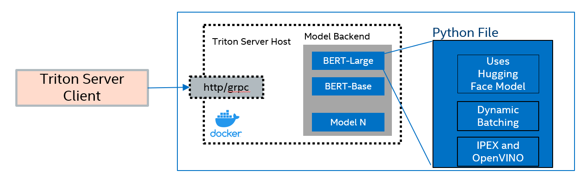

# Serving BERT models with Triton Server and Intel® Extension for PyTorch optimizations

## Description
This sample provide code to integrate Intel® Extension for PyTorch with Triton Inference Server framework. This project provides custom Python backend for Intel® Extension for PyTorch and additional dynamic batching algorithm to improve the performance. This code can be used as performance benchmark for Bert-Base and Bert-Large models.



## Preparation
You'll need to install Docker Engine on your development system. Note that while **Docker Engine** is free to use, **Docker Desktop** may require you to purchase a license. See the [Docker Engine Server installation instructions](https://docs.docker.com/engine/install/#server) for details.
## Supported models
Currently AI Inference samples support following Bert models finetuned on Squad dataset:
- bert_base        - PyTorch+Intel® Extension for PyTorch [Bert Base uncased](https://huggingface.co/csarron/bert-base-uncased-squad-v1 "Bert Base uncased")
- bert_large        - PyTorch+Intel® Extension for PyTorch [Bert Large uncased](https://huggingface.co/bert-large-uncased-whole-word-masking-finetuned-squad "Bert Large uncased")

### Build Container
To add Intel Extension for PyTorch to the Triton Inference Server Container Image, use the following command to build the container used in this example.

```bash
docker build -t triton:ipex .
```

> [!TIP]
> You can customize the PyTorch package versions that get installed by adding `--build-arg PYTORCH_VERSION=<new-version>` based on the arguments found in the [Dockerfile](Dockerfile#L12-15).

> [!NOTE]
> If you are working under a corporate proxy you will need to include the following parameters in your `docker build` command: `--build-arg http_proxy=${http_proxy} --build-arg https_proxy=${https_proxy}`.

### Start Server
Start the Inference Server.

```bash
docker run \
    -d --rm --shm-size=1g \
    --net host --name server \
    -p 8000:8000 -p 8001:8001 -p 8002:8002 \
    -v $PWD:/models \
    triton:ipex
```

> [!NOTE]
> If you are working under a corporate proxy you will need to include the following parameters in your `docker run` command: `-e http_proxy=${http_proxy} -e https_proxy=${https_proxy}`

Check the server logs and verify that both models have been registered successfully
```bash
docker logs server
```

Test the server connection, get model metadata, and make a test inference request to a model

```bash
curl -v localhost:8000/v2
curl -v localhost:8000/v2/health/ready
curl -v localhost:8000/v2/models/bert_base/versions/1
curl -v -X POST localhost:8000/v2/models/bert_base/versions/1/infer -d \
    '{
        "inputs": [ 
            {
                "name": "INPUT0",
                "shape": [ 1, 4 ],
                "datatype": "INT64",
                "data": [ 1, 2, 3, 4 ]
            }
        ]
    }'
```

> [!TIP]
> For more information about the Triton Inference Server HTTP/REST and GRPC APIs see the [Predict Protocol v2](https://github.com/kserve/kserve/tree/master/docs/predict-api/v2).

### Run Client Benchmark
Triton Inference Server comes with the tool `perf_analyzer`, that can be used to benchmark the inference server from any client. Use the docker run command below to benchmark the inference server from the same container image.

```bash
docker run \
    -it --rm \
    --net host --name client \
    triton:ipex \
    perf_analyzer \
        -u localhost:8000 \
        -m bert_base \
        --shape INPUT0:128 \
        --input-data zero \
        --sync \
        --concurrency-range 1 \
        --measurement-mode count_windows \
        --measurement-request-count 1000
```

Modify the perf_analyzer command to test different models with various concurrency, requests count, and input data.

### Stop the Server
When finished with benchmarking, stop the inference server with the following command:

```bash
docker container stop server
```

## License 
AI Inference samples project is licensed under Apache License Version 2.0. Refer to the [LICENSE](../LICENSE) file for the full license text and copyright notice.

This distribution includes third party software governed by separate license terms.

3-clause BSD license:
- [model.py](./bert_base/1/model.py) -  for Intel® Extension for PyTorch optimized workload
- [model.py](./bert_large/1/model.py) -  for Intel® Extension for PyTorch optimized workload

This third party software, even if included with the distribution of the Intel software, may be governed by separate license terms, including without limitation, third party license terms, other Intel software license terms, and open source software license terms. These separate license terms govern your use of the third party programs as set forth in the [THIRD-PARTY-PROGRAMS](./THIRD-PARTY-PROGRAMS) file.

## Trademark Information
Intel, the Intel logo and Intel Xeon are trademarks of Intel Corporation or its subsidiaries.
* Other names and brands may be claimed as the property of others.

&copy;Intel Corporation
